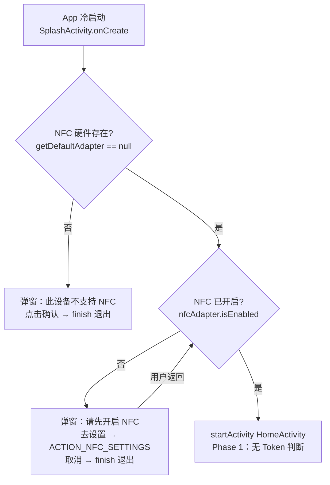
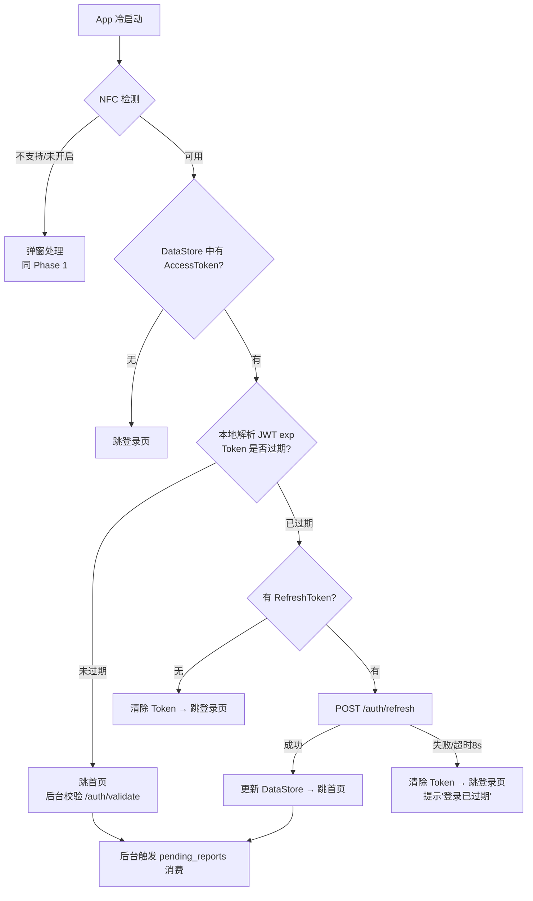
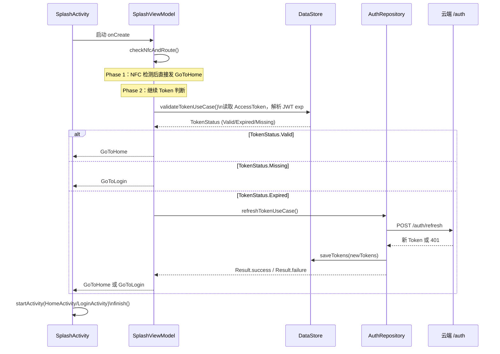

# 01 · 启动模块：SplashActivity · 路由决策 · NFC 状态监听

> **模块边界**：App 冷启动到"进入第一个业务页面"之间的全部逻辑。  
> **依赖模块**：`02-auth`（读取 Token，Phase 2+）、`08-storage`（DataStore）  
> **输出**：路由到登录页（Phase 2+） 或 首页（HomeActivity/WebView）

---

## Phase 1：硬件调试启动（NFC 检测 → 直接进首页）

### 职责范围

| 职责 | 说明 |
| :--- | :--- |
| NFC 硬件检测 | 检测设备是否支持 NFC 且已开启 |
| 直接路由首页 | NFC 可用即跳转 HomeActivity，无 Token 判断 |
| NFC 状态广播监听 | 运行中监听 NFC 开/关，更新首页按钮状态 |
| **跳过** | Token 验证、RefreshToken、登录页路由、pending_reports 消费 |

### 业务流程图



### 实现规格

#### SplashActivity

```kotlin
class SplashActivity : AppCompatActivity() {
    private val viewModel: SplashViewModel by viewModels()

    override fun onCreate(savedInstanceState: Bundle?) {
        super.onCreate(savedInstanceState)
        lifecycleScope.launch {
            viewModel.uiState.collect { state ->
                when (state) {
                    is StartupUiState.GoToHome  -> { startActivity<HomeActivity>(); finish() }
                    is StartupUiState.NfcNotAvailable -> showNfcNotAvailableDialog()
                    is StartupUiState.NfcDisabled     -> showNfcDisabledDialog()
                    // Phase 2+: GoToLogin
                    else -> { /* Checking 状态：等待 */ }
                }
            }
        }
    }
}
```

#### SplashViewModel（Phase 1 版）

```kotlin
@HiltViewModel
class SplashViewModel @Inject constructor(
    @ApplicationContext private val context: Context,
    // Phase 2+ 才注入：private val validateTokenUseCase: ValidateTokenUseCase,
    // Phase 2+ 才注入：private val refreshTokenUseCase: RefreshTokenUseCase,
) : ViewModel() {

    private val _uiState = MutableStateFlow<StartupUiState>(StartupUiState.Checking)
    val uiState: StateFlow<StartupUiState> = _uiState.asStateFlow()

    init {
        viewModelScope.launch { checkNfcAndRoute() }
    }

    private fun checkNfcAndRoute() {
        val nfcAdapter = NfcAdapter.getDefaultAdapter(context)
        when {
            nfcAdapter == null -> _uiState.value = StartupUiState.NfcNotAvailable
            !nfcAdapter.isEnabled -> _uiState.value = StartupUiState.NfcDisabled
            else -> {
                // Phase 1：直接进首页，不判断 Token
                _uiState.value = StartupUiState.GoToHome
                // TODO Phase 2：调用 validateTokenUseCase → 决定 GoToHome 或 GoToLogin
            }
        }
    }
}

sealed class StartupUiState {
    object Checking         : StartupUiState()
    object GoToHome         : StartupUiState()
    object GoToLogin        : StartupUiState()  // Phase 2+ 启用
    object NfcNotAvailable  : StartupUiState()
    object NfcDisabled      : StartupUiState()
}
```

### 验收要点

- [ ] 不支持 NFC 的设备：弹窗提示，点确认退出
- [ ] NFC 未开启：弹窗引导去设置，用户返回后重新检测
- [ ] NFC 可用：直接进入首页（无等待，无 Token 判断）
- [ ] 首页 Unlock/Lock 按钮随 NFC 状态启用/禁用

---

## Phase 2：完整路由（Token 验证 → 登录页或首页）

### 新增 / 变更说明

| 变更项 | Phase 1 | Phase 2 |
| :--- | :--- | :--- |
| NFC 检测后 | 直接进首页 | 检查 Token → 路由 |
| Token 判断 | 不存在 | 本地解析 JWT exp |
| 静默刷新 | 不存在 | RefreshToken → 重试 |
| 路由目标 | 只有 HomeActivity | HomeActivity 或 LoginActivity |
| 整体超时保护 | 不需要 | 3 秒（决策树整体） |

### 业务流程图



### 实现规格

#### SplashViewModel（Phase 2 完整版）

```kotlin
@HiltViewModel
class SplashViewModel @Inject constructor(
    @ApplicationContext private val context: Context,
    private val validateTokenUseCase: ValidateTokenUseCase,
    private val refreshTokenUseCase: RefreshTokenUseCase,
) : ViewModel() {

    init {
        viewModelScope.launch {
            withTimeout(3_000L) {
                checkNfcAndRoute()
            }
        }
    }

    private suspend fun checkNfcAndRoute() {
        val nfcAdapter = NfcAdapter.getDefaultAdapter(context)
        if (nfcAdapter == null) { _uiState.value = StartupUiState.NfcNotAvailable; return }
        if (!nfcAdapter.isEnabled) { _uiState.value = StartupUiState.NfcDisabled; return }

        when (validateTokenUseCase()) {
            TokenStatus.Valid   -> _uiState.value = StartupUiState.GoToHome
            TokenStatus.Missing -> _uiState.value = StartupUiState.GoToLogin
            TokenStatus.Expired -> tryRefreshToken()
        }
    }

    private suspend fun tryRefreshToken() {
        refreshTokenUseCase().fold(
            onSuccess = { _uiState.value = StartupUiState.GoToHome },
            onFailure = { _uiState.value = StartupUiState.GoToLogin }
        )
    }
}
```

### 验收要点

- [ ] 有效 Token：跳首页，无登录页闪现
- [ ] 过期 Token + 有效 RefreshToken：静默刷新，跳首页
- [ ] RefreshToken 失败：清 Token，跳登录页，提示「登录已过期」
- [ ] 无 Token（首次安装）：跳登录页
- [ ] 决策树整体 < 3 秒（超时保护）

---

## Phase 3：启动时后台任务

### 新增 / 变更说明

| 新增项 | 说明 |
| :--- | :--- |
| `ConsumePendingReportsUseCase` | 启动时后台触发，不阻塞路由决策 |
| 前台刷新权限快照 | `ProcessLifecycleOwner ON_START` 触发 `SyncPermissionsUseCase` |

### 实现规格

```kotlin
// SplashActivity → 跳首页后异步触发
lifecycleScope.launch(Dispatchers.IO) {
    consumePendingReportsUseCase()  // 不 await，不阻塞
}

// AppLifecycleObserver（在 Application 中注册）
class AppLifecycleObserver @Inject constructor(
    private val syncPermissionsUseCase: SyncPermissionsUseCase
) : DefaultLifecycleObserver {
    override fun onStart(owner: LifecycleOwner) {
        // 每次 App 前台化时触发，网络失败静默忽略
        owner.lifecycleScope.launch { syncPermissionsUseCase() }
    }
}
```

### 验收要点

- [ ] 启动时 `pending_reports` 队列静默消费（不阻塞启动流程）
- [ ] App 前台化时权限快照刷新，`isValid=false` 设备自动灰化
- [ ] 上述后台任务失败时静默忽略，不影响用户操作

---

## 数据流时序图


