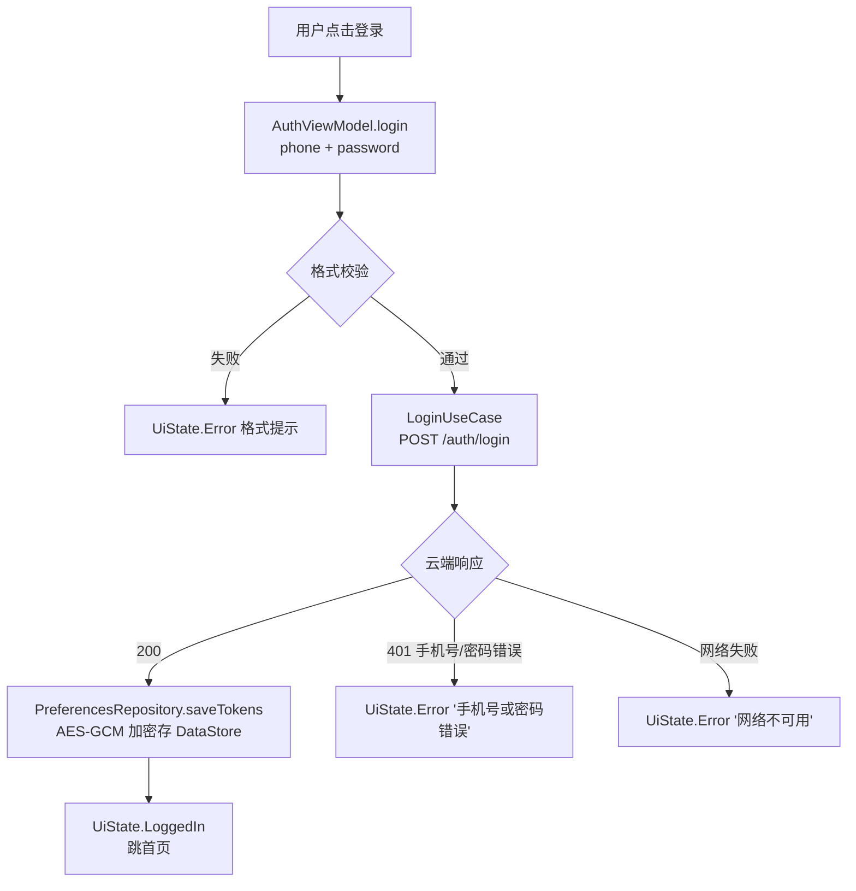
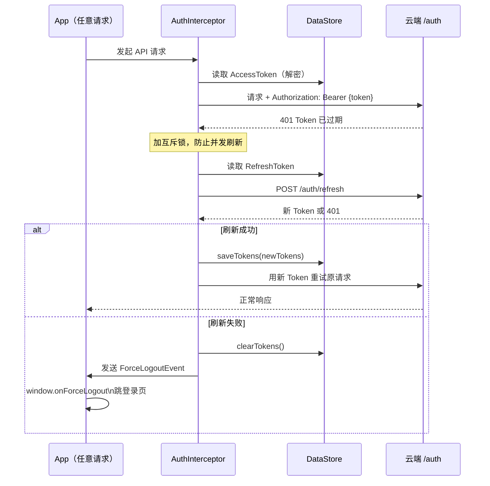
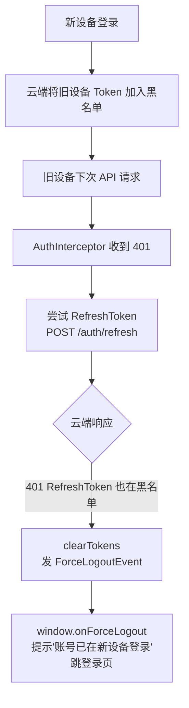

# 02 · 认证模块：登录 · Token 管理 · 单设备策略

> **模块边界**：账号认证的完整生命周期，包括登录、登出、修改密码、Token 存储、静默刷新、换机吊销。  
> **依赖模块**：`08-storage`（DataStore Token 存储）、`09-network`（AuthInterceptor、认证 API）  
> **被依赖**：`01-startup`（Token 有效性判断）、`07-webview-bridge`（登录/登出事件）

---

## Phase 1：不参与（Stub / 假流程）

### 职责范围

Phase 1 整个模块不参与。所有认证相关类提供 stub，避免编译失败并为 Phase 2 预留接口。

| 组件 | Phase 1 处理方式 |
| :--- | :--- |
| `AuthViewModel` | 空实现，所有方法 `TODO("Phase 2")` |
| `AuthRepository` | `FakeAuthRepository`，返回固定值或静默忽略 |
| 登录页 | 不显示；Splash 直接跳首页 |
| WebView 桥 `onLoginClicked` | stub：只打日志 |
| WebView 桥 `onLogout` | stub：可选假流程（直接回调 `window.onLogoutDone`） |
| Token 存储 | 无 |

### FakeAuthRepository 骨架

**文件**：`data/fake/FakeAuthRepository.kt`

```kotlin
class FakeAuthRepository @Inject constructor() : AuthRepository {

    override suspend fun login(phone: String, password: String): Pair<User, AuthTokens> {
        // Phase 1：不会被调用（无登录页）
        // 若意外调用，返回固定调试用户
        return Pair(
            User(
                userId   = "debug-user-001",
                phone    = "13800000000",
                username = "Debug User",
                role     = UserRole.Owner,
                email    = null
            ),
            AuthTokens(
                accessToken  = "fake-access-token-phase1",
                refreshToken = "fake-refresh-token-phase1"
            )
        )
        // TODO("Phase 2: 替换为 RemoteAuthRepository，调用 POST /auth/login")
    }

    override suspend fun logout(): Unit {
        // Phase 1：静默忽略（无 Token 需要吊销）
        // TODO("Phase 2: POST /auth/logout 通知云端吊销")
    }

    override suspend fun refreshToken(refreshToken: String): AuthTokens {
        // TODO("Phase 2: POST /auth/refresh")
        throw UnsupportedOperationException("Phase 2: refreshToken not implemented")
    }

    override suspend fun updatePassword(currentPassword: String, newPassword: String): Unit {
        // TODO("Phase 2: PUT /auth/password")
        throw UnsupportedOperationException("Phase 2: updatePassword not implemented")
    }

    override suspend fun deleteAccount(): Unit {
        // TODO("Phase 2: DELETE /auth/account")
        throw UnsupportedOperationException("Phase 2: deleteAccount not implemented")
    }
}
```

### AuthViewModel Stub 骨架

**文件**：`presentation/auth/AuthViewModel.kt`

```kotlin
@HiltViewModel
class AuthViewModel @Inject constructor(
    // Phase 2+ 才注入真实 UseCase：
    // private val loginUseCase: LoginUseCase,
    // private val logoutUseCase: LogoutUseCase,
    // private val updatePasswordUseCase: UpdatePasswordUseCase,
) : ViewModel() {

    private val _uiState = MutableStateFlow<AuthUiState>(AuthUiState.Idle)
    val uiState: StateFlow<AuthUiState> = _uiState.asStateFlow()

    fun login(phone: String, password: String) {
        // TODO("Phase 2: loginUseCase(phone, password)")
    }

    fun logout() {
        // TODO("Phase 2: logoutUseCase()")
    }

    fun updatePassword(current: String, new: String, confirm: String) {
        // TODO("Phase 2: updatePasswordUseCase(current, new, confirm)")
    }

    fun deleteAccount() {
        // TODO("Phase 2: deleteAccountUseCase()")
    }
}

sealed class AuthUiState {
    object Idle              : AuthUiState()
    object Loading           : AuthUiState()
    data class LoggedIn(val user: User) : AuthUiState()
    data class Error(val message: String) : AuthUiState()
    object LoggedOut         : AuthUiState()
    object PasswordUpdated   : AuthUiState()
}
```

### 验收要点（Phase 1）

- [ ] 编译通过，没有因认证模块缺失导致的编译错误
- [ ] App 启动直接进首页，无登录页闪现
- [ ] WebView 桥 `onLoginClicked` / `onLogout` 被调用时不崩溃

---

## Phase 2：完整认证（登录/Token 生命周期/静默刷新）

### 新增 / 变更说明

| 新增项 | 说明 |
| :--- | :--- |
| 登录页 | Splash → Token 无效 → LoginActivity |
| `LoginUseCase` | 格式校验 + 调 `/auth/login` + 存 Token |
| `LogoutUseCase` | 云端吊销 + 清 Token + 清 Room |
| `UpdatePasswordUseCase` | 三段式校验 + 调 `/auth/password` |
| `ValidateTokenUseCase` | 本地解析 JWT exp（纯本地，无网络） |
| `RefreshTokenUseCase` | 携带 RefreshToken 调 `/auth/refresh` |
| Token 加密存储 | Android Keystore AES-GCM（见 `11-security.md`） |
| `AuthInterceptor` | 自动注入 Token + 401 透明刷新（见 `09-network.md`） |

### 业务流程图



### 数据模型

```kotlin
data class User(
    val userId: String,
    val phone: String,
    val username: String,
    val role: UserRole,   // Owner / Guest
    val email: String?
)

data class AuthTokens(
    val accessToken: String,
    val refreshToken: String
)

enum class TokenStatus { Valid, Expired, Missing }
```

### UseCase 清单

#### LoginUseCase

```kotlin
class LoginUseCase @Inject constructor(
    private val authRepository: AuthRepository,
    private val preferencesRepository: PreferencesRepository
) {
    suspend operator fun invoke(phone: String, password: String): Result<User> {
        if (!phone.matches(Regex("\\d{11}"))) return Result.failure(ValidationException("手机号格式错误"))
        if (password.length < 8) return Result.failure(ValidationException("密码至少8位"))
        return try {
            val (user, tokens) = authRepository.login(phone, password)
            preferencesRepository.saveTokens(tokens)
            Result.success(user)
        } catch (e: ApiException) {
            Result.failure(Exception(mapApiError(e)))
        } catch (e: IOException) {
            Result.failure(Exception("网络不可用，请检查连接"))
        }
    }
}
```

#### ValidateTokenUseCase（纯本地）

```kotlin
class ValidateTokenUseCase @Inject constructor(
    private val preferencesRepository: PreferencesRepository
) {
    suspend operator fun invoke(): TokenStatus {
        val token = preferencesRepository.getAccessToken() ?: return TokenStatus.Missing
        return try {
            val exp = parseJwtExp(token)
            val bufferMs = 60_000L
            if (System.currentTimeMillis() + bufferMs < exp * 1000) TokenStatus.Valid
            else TokenStatus.Expired
        } catch (e: Exception) {
            TokenStatus.Expired
        }
    }

    private fun parseJwtExp(jwt: String): Long {
        val payload = jwt.split(".")[1]
        val decoded = Base64.decode(payload, Base64.URL_SAFE or Base64.NO_PADDING)
        val json = JSONObject(String(decoded))
        return json.getLong("exp")
    }
}
```

#### LogoutUseCase

```kotlin
class LogoutUseCase @Inject constructor(
    private val authRepository: AuthRepository,
    private val preferencesRepository: PreferencesRepository,
    private val deviceRepository: DeviceRepository
) {
    suspend operator fun invoke() {
        try { authRepository.logout() } catch (_: Exception) { /* 网络失败也继续本地清除 */ }
        preferencesRepository.clearTokens()
        deviceRepository.clearLocalCache()
    }
}
```

### 验收要点（Phase 2）

- [ ] 登录成功：Token 加密存储，跳首页
- [ ] 登录失败（密码错误）：显示 `"手机号或密码错误"`
- [ ] 登出：Token 清除，Room 清空，跳登录页
- [ ] 修改密码：三段式校验，旧密码错误时提示
- [ ] `ValidateTokenUseCase` 离线可用（纯本地 JWT 解析）

---

## Phase 3：换机吊销 + 账号注销

### 新增 / 变更说明

| 新增项 | 说明 |
| :--- | :--- |
| 换机吊销（旧设备被踢） | `HomeViewModel.init` 调 `GET /auth/validate`，401 → 强退 |
| 强退事件广播 | `ForceLogoutEvent` SharedFlow，`MainActivity` 监听跳登录页 |
| `DeleteAccountUseCase` | 云端注销 + 清 DataStore + 清 Room 全部三表 |

### Token 生命周期时序图



### 换机吊销流程



### 验收要点（Phase 3）

- [ ] 旧设备：Token 被吊销后下次操作正确强退
- [ ] 强退提示文案：`"您的账号已在新设备登录，请重新验证"`
- [ ] `DeleteAccountUseCase`：云端注销 + 三表全清
- [ ] 注销失败（网络断开）：提示错误，不清本地数据
