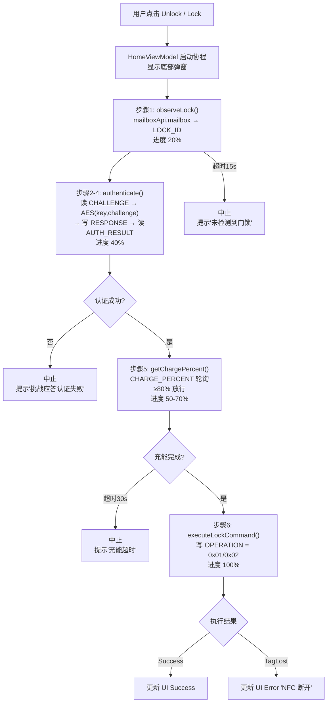
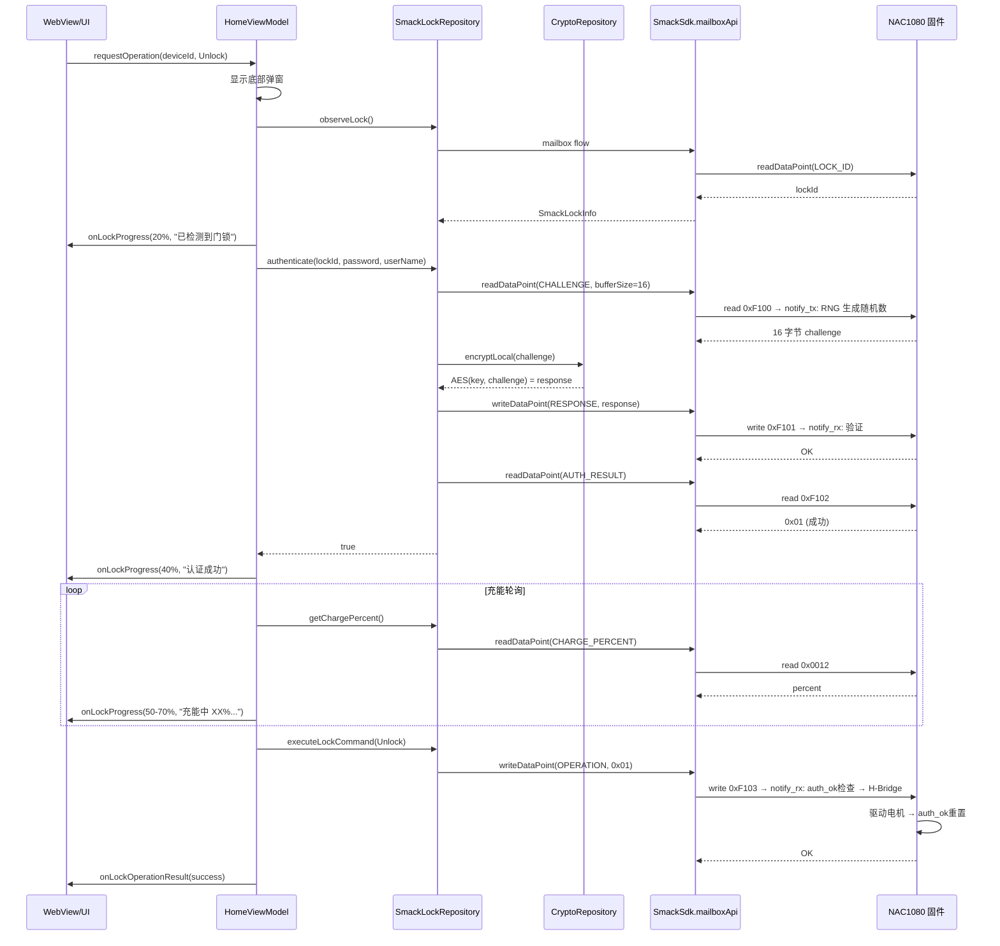
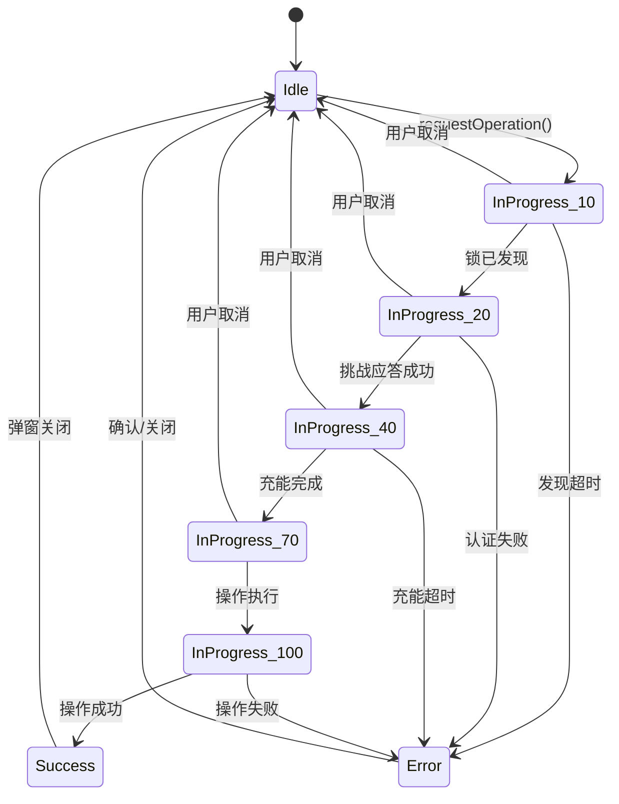

# 03 · NFC 核心模块：挑战应答协议 · 进度状态机 · 异常处理

> **模块边界**：从用户点击 Unlock/Lock 到操作最终完成（或取消/失败）的完整流程。
> **依赖模块**：`07-webview-bridge`（进度回调）、`09-network`（云端加密请求，Phase 2+）、`08-storage`（pending_reports 写入，Phase 3）
> **被依赖**：`07-webview-bridge`（桥接调用入口）
> **底层依赖**：SmAcK SDK（`mailboxApi`）、NAC1080 固件（自定义数据点 + 挑战应答）、`CryptoRepository`（AES 加密）

---

## Phase 1：挑战应答协议（Challenge-Response）

### 职责范围

| 职责 | 说明 |
| :--- | :--- |
| 六步挑战应答协议 | 发现锁 → 挑战 → 应答 → 确认 → 充能 → 执行 |
| SmAcK SDK 生命周期 | SmackSdk.onCreate() + onNewIntent() |
| 硬件 RNG 挑战 | 固件每次生成 16 字节新随机数，防重放 |
| AES-128 应答 | CryptoRepository.encryptLocal(challenge) |
| 充能管理 | CHARGE_PERCENT 轮询等待电容充满 |
| 进度状态机 | 六步更新进度百分比，驱动底部弹窗 |
| 异常处理 | 认证失败、TagLostException、超时 |

### 安全特性

| 特性 | 实现方式 |
| :--- | :--- |
| 防重放 | CHALLENGE 每次读取由硬件 RNG 重新生成，验证后立即清零 |
| 一次性操作 | auth_ok 在 OPERATION 执行后重置 |
| 防嗅探 | 即使截获 CHALLENGE+RESPONSE，不知密钥无法伪造新 RESPONSE |
| 恒时比较 | 固件使用 `diff \|= expected ^ response` 防计时侧信道 |

### 业务流程图



### 实现规格

#### SmackLockRepository（核心 NFC 仓库）

**文件**：`data/nfc/SmackLockRepository.kt`

```kotlin
class SmackLockRepository @Inject constructor(
    private val smackSdk: SmackSdk,
    private val cryptoRepository: CryptoRepository
) : NfcRepository {
    fun observeLock(): Flow<SmackLockInfo?>       // mailboxApi.mailbox → LOCK_ID
    suspend fun authenticate(...): Boolean         // CHALLENGE → AES → RESPONSE → AUTH_RESULT
    suspend fun getChargePercent(): Int             // CHARGE_PERCENT 明文读取
    suspend fun executeLockCommand(...): Result     // OPERATION 明文写入
}
```

#### HomeViewModel（六步协程编排）

```kotlin
private suspend fun executeLockOperation(deviceId: String, operationType: OperationType) {
    // 步骤1: 发现锁
    val lockInfo = withTimeout(15s) { nfcRepository.observeLock().filterNotNull().first() }

    // 步骤2-4: 挑战应答认证
    val authenticated = nfcRepository.authenticate(lockInfo.lockId, password, userName)
    if (!authenticated) throw AuthenticationException()

    // 步骤5: 充能等待
    withTimeout(30s) {
        while (nfcRepository.getChargePercent() < 80) delay(500ms)
    }

    // 步骤6: 执行
    val result = nfcRepository.executeLockCommand(operationType)
}
```

### 验收要点

- [ ] mailboxApi.mailbox 能发现 NFC Tag（observeLock 返回非空）
- [ ] CHALLENGE 每次读取值不同（硬件 RNG）
- [ ] AES(key, challenge) 正确时 AUTH_RESULT = 0x01
- [ ] AES(wrongKey, challenge) 时 AUTH_RESULT = 0x00
- [ ] CHARGE_PERCENT 能明文读取充能百分比
- [ ] OPERATION 写入后电机正确驱动（需 auth_ok）
- [ ] 未认证直接写 OPERATION → STATUS = ERROR
- [ ] 进度条：0% → 20% → 40% → 50-70% → 100% 正常流转
- [ ] TagLostException 场景：正确提示 NFC 断开
- [ ] 底部弹窗「Cancel」按钮能取消协程并重置进度

---

## Phase 2：云端密码验证

### 新增 / 变更说明

| 变更项 | Phase 1 | Phase 2 |
| :--- | :--- | :--- |
| 密钥来源 | LocalKeyManager 预存密钥 | 云端 HSM 管理，按需下发 |
| 加密位置 | CryptoRepository.encryptLocal() | CryptoRepository.requestCipher() |
| 步骤结束后 | 无上报 | ReportOperationResultUseCase（异步上报） |

---

## Phase 3：完整异常与上报

### 完整异常处理表

| 异常类型 | 触发步骤 | UI 表现 |
| :--- | :--- | :--- |
| 锁发现超时（15s） | 步骤1 | "未检测到门锁，请靠近" |
| 认证失败 | 步骤2-4 | "挑战应答认证失败" |
| 充能超时（30s） | 步骤5 | "充能超时，请保持手机靠近" |
| TagLostException | 任意步骤 | "NFC 连接断开，请重新靠近" |
| IOException | 任意步骤 | "NFC 信号中断，请重新靠近" |
| 用户取消 | 任意 | 弹窗关闭，进度重置 |

---

## 数据流时序图



---

## 进度状态机图


