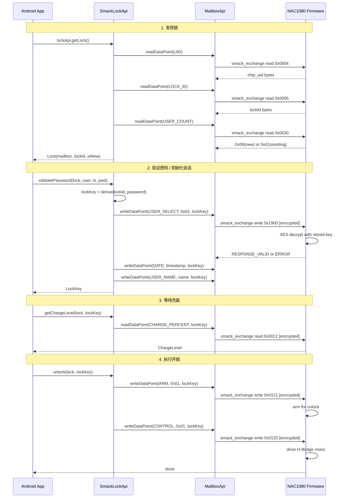

# 03 · NFC SmAcK SDK 集成可行性分析

> **文档目的**：评估 Infineon SmAcK SDK 对 ARES_AN 项目 NFC 开/关锁需求的支持能力，确定集成方案。
> **结论**：SmAcK SDK + Lock Showcase 固件可完全满足需求；自定义固件只需对齐数据点 ID 即可复用 `SmackLockApi`。

---

## 1. 可行性结论

| 需求 | SmAcK SDK 能力 | 结论 |
|:-----|:---------------|:-----|
| 挑战应答认证 | AES-128 对称加密数据交换（lockKey = derive(lockId, password)） | 完全满足 |
| NFC 通信协议 | NfcA + SmAcK 数据点交换协议（非原始 APDU） | 完全满足 |
| 电机控制 | lockApi.lock() / unlock() → ARM + CONTROL 数据点 → H-Bridge | 完全满足 |
| 充能管理 | lockApi.getChargeLevel() → CHARGE_PERCENT 数据点 | 完全满足 |
| 会话管理 | initializeSession() / validatePassword() → USER_SELECT + DATE + USER_NAME | 完全满足 |
| 自定义固件兼容 | LockApi 是接口，固件只要实现相同数据点即可复用 SmackLockApi | 完全满足 |

## 2. 原五步协议 vs SmAcK lockApi 四步流程

### 原协议（IsoDep + APDU）

```
1. 发送操作位 → 接收 deviceId
2. 接收 challenge（16 字节随机数）
3. 本地/云端 AES 加密
4. 发送密文
5. 接收执行结果
```

### SmAcK lockApi 四步流程

```
1. 发现锁：getLock() → Lock(mailbox, lockId, isNew)
2. 认证：validatePassword(lock, user, ts, pwd) → LockKey
3. 充能等待：getChargeLevel(lock, lockKey) → ChargeLevel
4. 执行：unlock(lock, lockKey) 或 lock(lock, lockKey)
```

### 关键差异

| 方面 | 原协议 | SmAcK lockApi |
|:-----|:-------|:--------------|
| NFC 技术 | IsoDep (ISO 14443-4) | NfcA (ISO 14443-3A) |
| 通信层 | 原始 APDU 指令 | smack_exchange 数据点读写 |
| 认证方式 | 自定义 challenge-response | AES-128 加密数据交换，lockKey 派生自 lockId + password |
| 充能步骤 | 无（假设有源） | 必须（无源锁需等电容充满） |
| 进度步骤 | 5 步 (20→40→65→85→100%) | 4 步 (20→40→70→100%) |
| 设备识别 | APDU 读取 deviceId | lockApi.getLock() 读取 lockId |

## 3. 完整调用关系图



## 4. 数据点协议表

### 锁核心数据点（LockDataPoint）

| ID | 名称 | 类型 | 读/写 | 加密 | 说明 |
|:---|:-----|:-----|:------|:-----|:-----|
| 0x0005 | LOCK_ID | UINT64 | R | 否 | 锁唯一标识 |
| 0x0030 | USER_COUNT | UINT8 | R | 否 | 0x00=全新锁, 0x01=已设密钥 |
| 0x1900 | USER_SELECT | UINT8 | W | 是 | 会话类型: 0x01=USER, 0xFE=SUPERVISOR |
| 0x1800 | DATE | INT64 | W | 是 | 当前时间戳（秒，Epoch） |
| 0x1801 | USER_NAME | STRING | W | 是 | 用户名（最长 40 字节 UTF-8） |
| 0x1902 | LOCK_KEY | ARRAY | W | 否 | 设置新密钥（16 字节） |
| 0x1903 | LOCK_KEY_CHECK | ARRAY | R | 是 | 验证密钥（用新 key 加密的 lockId） |
| 0x1901 | LOCK_KEY_STORE | UINT32 | W | 否 | 确认存储密钥 |
| 0x0121 | ARM | UINT8 | W | 是 | 预备动作: 1=开锁, 2=关锁 |
| 0x0120 | CONTROL | UINT8 | W | 是 | 执行动作: 1=开锁, 2=关锁 |
| 0x0020 | STATUS | UINT8 | R | 是 | 0=已开, 1=已关, 2=进行中, 7=错误 |
| 0x0021 | CONTROL_PROGRESS | UINT8 | R | 是 | 进度百分比 |

### 通用数据点（MailboxDataPoint）

| ID | 名称 | 类型 | 读/写 | 加密 | 说明 |
|:---|:-----|:-----|:------|:-----|:-----|
| 0x0004 | UID | UINT64 | R | 否 | 芯片 UID |
| 0x0010 | CHARGE_RAW | UINT16 | R | 否 | 原始电压值 |
| 0x0012 | CHARGE_PERCENT | UINT8 | R | 是 | 充电百分比 |
| 0x0001 | FIRMWARE_VERSION | UINT32 | R | 否 | 固件版本 |
| 0x0003 | FIRMWARE_NAME | STRING | R | 否 | 固件名称 |

### 电机控制数据点 (0x1000–0x1007)

| ID | 名称 | 类型 | 读/写 |
|:---|:-----|:-----|:------|
| 0x1000 | CONFIG_METHOD | UINT8 | W |
| 0x1001 | CLAMPING_VOLTAGE | UINT8 | W |
| 0x1002 | START_VOLTAGE | UINT8 | W |
| 0x1003 | STOP_VOLTAGE | UINT8 | W |
| 0x1004 | ON_TIME | UINT16 | W |
| 0x1005 | OFF_TIME | UINT16 | W |
| 0x1006 | TOTAL_MOTOR_RUNTIME | UINT16 | W |
| 0x1007 | MOTOR_RESERVED | UINT8 | W |

## 5. 两阶段切换说明

### Phase 1A：Lock Showcase HEX + lockApi

- 使用英飞凌预编译的 Lock Showcase 固件（`lock_demo_v0-1-6-2_A21004_HW3-1.hex`）
- Android 端直接使用 `SmackLockApi`（SDK 内置实现）
- 目标：最快验证硬件链路和电机动作

### Phase 1B：自定义固件 + lockApi

- 使用 NAC1080 C SDK 编写自定义固件
- 数据点 ID 完全对齐 `LockDataPoint.kt`，保持与 `SmackLockApi` 兼容
- Android 端代码无需修改
- 目标：完全掌握固件协议，为后续定制打基础

### Phase 2 演进路径

- 步骤 2 认证：可切换为云端密码验证
- 步骤 4 执行后：新增异步结果上报
- NFC 仓库接口保持不变，仅替换认证策略

## 6. 架构对比

### 变更前

```
WebView → Bridge → HomeViewModel → 5 UseCases → NfcRepository(IsoDep+APDU) → NAC1080
```

### 变更后

```
WebView → Bridge → HomeViewModel → SmackLockRepository(lockApi) → SmackSdk → NAC1080
                                                                    ↓
                                                              SmackLockApi
                                                                    ↓
                                                              MailboxApi
                                                                    ↓
                                                              NfcA(SmAcK协议)
```

### DI 变更

| 模块 | 变更前 | 变更后 |
|:-----|:-------|:-------|
| NfcModule | 提供 NfcAdapter? | 移除（SmackSdk 自管理） |
| SmackModule | 不存在 | 新增，提供 SmackSdk 单例 |
| RepositoryModule | NfcRepository → NfcRepositoryImpl | NfcRepository → SmackLockRepository |
| UseCases | 5 个独立 UseCase | 合并到 SmackLockRepository 内部 |
