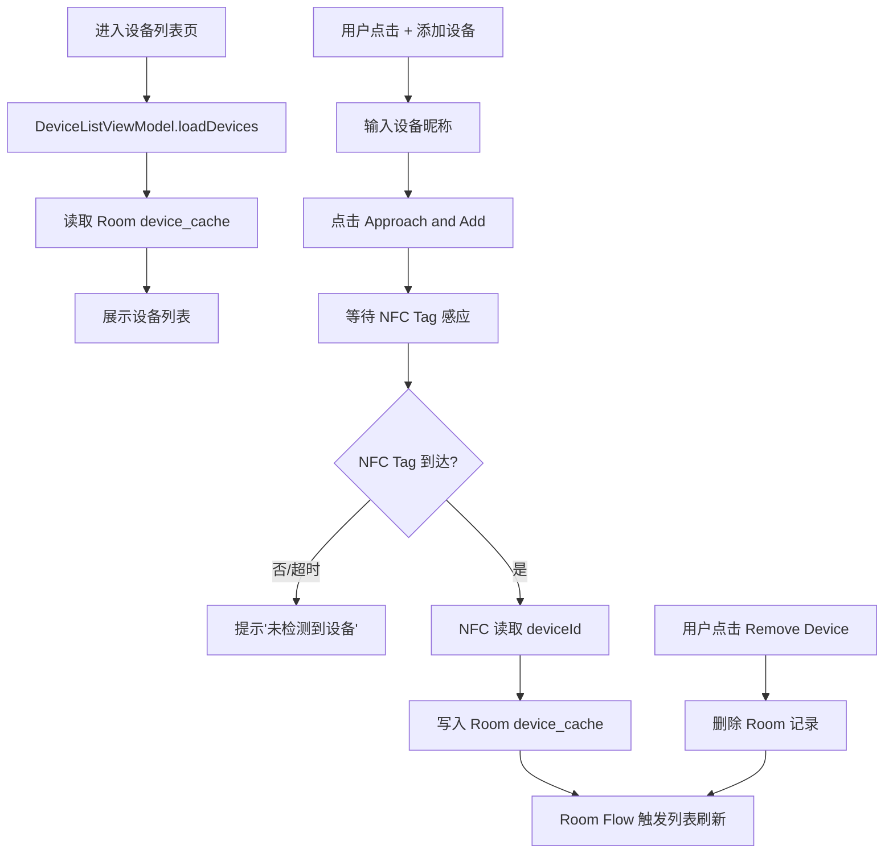
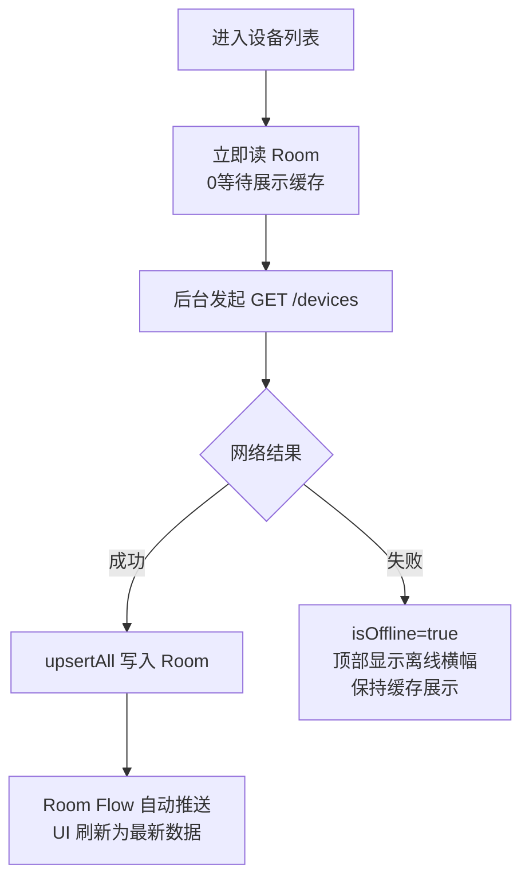
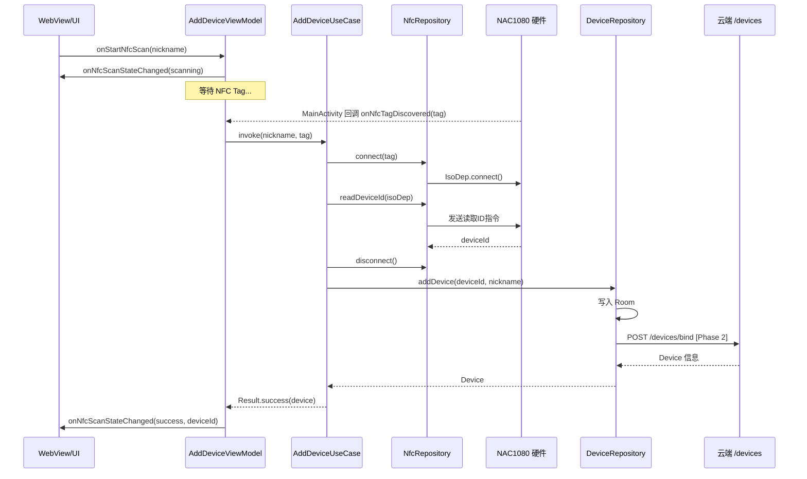
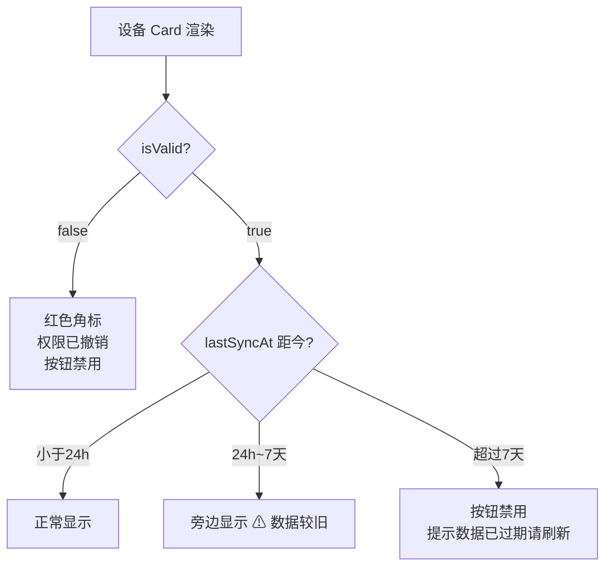

# 04 · 设备管理模块：列表 · 搜索 · 添加绑定 · 详情

> **模块边界**：设备列表展示、搜索过滤、新设备 NFC 绑定、设备详情查看与删除。  
> **依赖模块**：`08-storage`（Room 缓存）、`09-network`（Phase 2+ 远端请求）、`03-nfc-core`（NFC 扫描绑定）  
> **被依赖**：`05-permission`（设备详情授权管理，Phase 2+）、`07-webview-bridge`

---

## Phase 1：本地设备管理（Room 直接读写，无云端）

### 职责范围

| 职责 | 说明 |
| :--- | :--- |
| 设备列表展示 | 从 Room `device_cache` 读取，支持离线展示 |
| 搜索过滤 | 本地按昵称关键词过滤 |
| 添加设备 | NFC 读取 deviceId → 直接写入 Room，不调云端 |
| 设备详情 | 展示基本信息（无授权管理） |
| 解绑设备 | 从 Room 删除记录 |
| **跳过** | 云端同步、授权用户列表、设备有效性时效校验 |

### 业务流程图



### 实现规格

#### DeviceListViewModel

```kotlin
@HiltViewModel
class DeviceListViewModel @Inject constructor(
    private val getDeviceListUseCase: GetDeviceListUseCase,
    private val searchDevicesUseCase: SearchDevicesUseCase
) : ViewModel() {

    private val _uiState = MutableStateFlow(DeviceListUiState())
    val uiState: StateFlow<DeviceListUiState> = _uiState.asStateFlow()

    init {
        viewModelScope.launch {
            getDeviceListUseCase().collect { devices ->
                _uiState.update { it.copy(
                    allDevices = devices,
                    filteredDevices = searchDevicesUseCase(devices, it.searchKeyword)
                )}
            }
        }
        loadDevices()
    }

    fun loadDevices() {
        viewModelScope.launch {
            _uiState.update { it.copy(isLoading = true) }
            // Phase 1：只读 Room，不发网络请求
            // Phase 2：TODO fetchAndCacheDevices() 从云端拉取
            _uiState.update { it.copy(isLoading = false) }
        }
    }

    fun onSearchKeywordChanged(keyword: String) {
        _uiState.update { state ->
            state.copy(
                searchKeyword   = keyword,
                filteredDevices = searchDevicesUseCase(state.allDevices, keyword)
            )
        }
    }
}
```

#### AddDeviceViewModel（Phase 1 版）

```kotlin
@HiltViewModel
class AddDeviceViewModel @Inject constructor(
    private val addDeviceUseCase: AddDeviceUseCase
) : ViewModel() {

    private val _uiState = MutableStateFlow(AddDeviceUiState())
    val uiState: StateFlow<AddDeviceUiState> = _uiState.asStateFlow()

    fun startNfcScan(nickname: String) {
        if (nickname.isBlank()) {
            _uiState.update { it.copy(errorMessage = "请输入设备昵称") }
            return
        }
        _uiState.update { it.copy(nfcScanState = NfcScanState.Scanning, errorMessage = null) }
        // 等待 MainActivity 回调 onNfcTagDiscovered
    }

    fun onNfcTagDiscovered(tag: Tag, nickname: String) {
        viewModelScope.launch {
            _uiState.update { it.copy(nfcScanState = NfcScanState.Connecting) }
            addDeviceUseCase(nickname, tag).fold(
                onSuccess = { device ->
                    _uiState.update { it.copy(nfcScanState = NfcScanState.Success(device.deviceId)) }
                },
                onFailure = { e ->
                    _uiState.update { it.copy(nfcScanState = NfcScanState.Error(e.message ?: "添加失败")) }
                }
            )
        }
    }
}
```

#### AddDeviceUseCase（Phase 1 本地版）

```kotlin
class AddDeviceUseCase @Inject constructor(
    private val nfcRepository: NfcRepository,
    private val deviceRepository: DeviceRepository
) {
    suspend operator fun invoke(nickname: String, tag: Tag): Result<Device> {
        return try {
            val isoDep = nfcRepository.connect(tag)
            val deviceId = nfcRepository.readDeviceId(isoDep)  // 发送"读取ID"专用指令
            nfcRepository.disconnect(isoDep)
            // Phase 1：直接写 Room
            val device = deviceRepository.addDevice(deviceId, nickname)
            // TODO Phase 2：同时调用 POST /devices/bind 向云端注册
            Result.success(device)
        } catch (e: IOException) {
            Result.failure(Exception("NFC 读取失败，请重新靠近"))
        }
    }
}
```

### 验收要点

- [ ] 设备列表能从 Room 读取并展示
- [ ] 按昵称搜索过滤正常
- [ ] NFC 靠近 → 读取 deviceId → 列表新增设备
- [ ] 删除设备后列表实时更新
- [ ] 设备列表为空时展示引导提示

---

## Phase 2：云端同步（Cache-Then-Network + 云端绑定）

### 新增 / 变更说明

| 变更项 | Phase 1 | Phase 2 |
| :--- | :--- | :--- |
| 设备列表来源 | 仅 Room | Room 缓存先展示 + 后台拉云端更新 |
| 添加设备 | 只写 Room | NFC 读取 deviceId + `POST /devices/bind` |
| 设备详情 | 基本信息 | 基本信息 + 授权用户列表（来自云端/Room） |
| 解绑设备 | 只删 Room | `DELETE /devices/{id}` + 删 Room |
| 离线提示 | 无 | `isOffline=true` 横幅 |

### Cache-Then-Network 数据流图



### NFC 添加设备时序图



### 实现规格（Phase 2 新增）

#### DeviceListViewModel.loadDevices 变更

```kotlin
fun loadDevices() {
    viewModelScope.launch {
        _uiState.update { it.copy(isLoading = true) }
        try {
            deviceRepository.fetchAndCacheDevices()  // Phase 2：拉云端写 Room
            _uiState.update { it.copy(isLoading = false, isOffline = false) }
        } catch (e: IOException) {
            _uiState.update { it.copy(isLoading = false, isOffline = true) }
        }
    }
}
```

### 验收要点

- [ ] 进入列表：先展示缓存，后台拉云端，无感知刷新
- [ ] 断网时：显示缓存 + 离线横幅
- [ ] 添加设备：NFC 读取 + 云端绑定（409 冲突时提示「设备已被绑定」）
- [ ] 解绑设备：云端成功后删 Room，断网时禁止操作

---

## Phase 3：设备有效性时效校验

### 新增 / 变更说明

| 新增项 | 说明 |
| :--- | :--- |
| `lastSyncAt` 时效规则 | 24h/7天 阈值检测，控制 UI 警告和操作禁用 |
| `isValid=false` 时 UI | 红色角标「权限已撤销」，操作按钮禁用 |

### 设备状态展示逻辑



### 验收要点

- [ ] `isValid=false` 设备灰化，操作按钮禁用
- [ ] 缓存超 7 天时操作按钮禁用，提示正确
- [ ] 下拉刷新后 `lastSyncAt` 更新，警告消失
