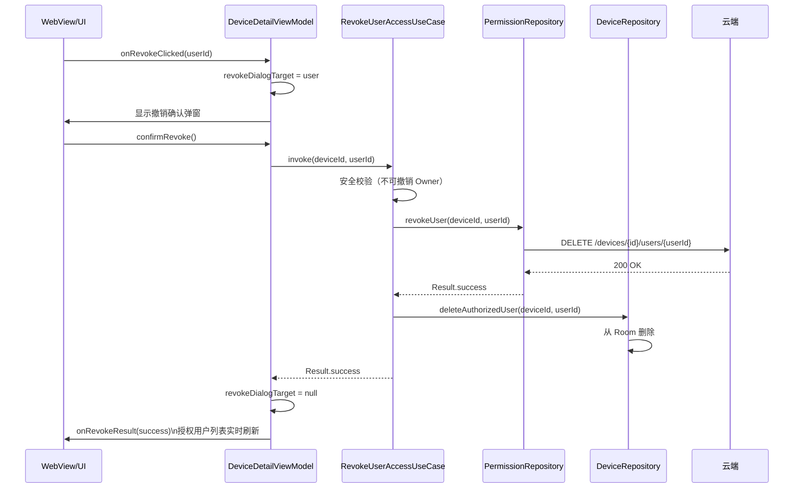
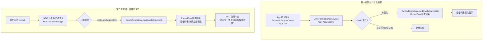

# 05 · 权限管理模块：邀请用户 · 撤销授权 · 权限感知刷新

> **模块边界**：设备授权用户的增删、权限状态的主动感知（前台刷新 + 操作时 403 兜底）。  
> **依赖模块**：`08-storage`（Room `authorized_user_cache`、`device_cache.isValid`）、`09-network`（权限相关 API）  
> **被依赖**：`04-device`（设备详情页）、`07-webview-bridge`（事件调用）

---

## Phase 1：不参与（Stub / 不涉及）

### 职责范围

Phase 1 整个模块不参与，所有相关 UseCase 提供 stub 骨架。

| 组件 | Phase 1 处理 |
| :--- | :--- |
| `InviteUserUseCase` | stub：抛出 `UnsupportedOperationException("Phase 2")` |
| `RevokeUserAccessUseCase` | stub：同上 |
| `SyncPermissionsUseCase` | stub：返回空列表（不调网络） |
| 设备详情页授权区块 | 前端隐藏或显示「Phase 2 启用」占位文案 |
| WebView 桥 `onInviteUser` / `onRevokeUser` | stub：只打日志 |

### UseCase Stub 骨架

**文件**：`domain/usecase/permission/InviteUserUseCase.kt`

```kotlin
class InviteUserUseCase @Inject constructor(
    private val permissionRepository: PermissionRepository
) {
    suspend operator fun invoke(deviceId: String, phone: String): Result<Unit> {
        // TODO("Phase 2: 格式校验 + POST /devices/{deviceId}/invite")
        return Result.failure(UnsupportedOperationException("Phase 2: invite not implemented"))
    }
}
```

**文件**：`domain/usecase/permission/RevokeUserAccessUseCase.kt`

```kotlin
class RevokeUserAccessUseCase @Inject constructor(
    private val permissionRepository: PermissionRepository
) {
    suspend operator fun invoke(deviceId: String, userId: String): Result<Unit> {
        // TODO("Phase 2: DELETE /devices/{deviceId}/users/{userId}")
        return Result.failure(UnsupportedOperationException("Phase 2: revoke not implemented"))
    }
}
```

**文件**：`domain/usecase/permission/SyncPermissionsUseCase.kt`

```kotlin
class SyncPermissionsUseCase @Inject constructor(
    private val permissionRepository: PermissionRepository,
    private val deviceRepository: DeviceRepository
) {
    suspend operator fun invoke(): Result<List<PermissionChange>> {
        // Phase 1：直接返回空，不发网络请求
        return Result.success(emptyList())
        // TODO("Phase 2: GET /devices/my → 对比 Room isValid → 标记变更")
    }
}
```

### 验收要点（Phase 1）

- [ ] 编译通过，权限相关 UseCase stub 不影响其他模块
- [ ] 设备详情页不显示授权管理区块（或显示占位文案）
- [ ] `SyncPermissionsUseCase` 在 `AppLifecycleObserver` 中调用时不崩溃

---

## Phase 2：完整权限管理（邀请 + 撤销 + 第一道防线）

### 新增 / 变更说明

| 新增项 | 说明 |
| :--- | :--- |
| `InviteUserUseCase` | 格式校验 + POST `/devices/{deviceId}/invite` |
| `RevokeUserAccessUseCase` | 安全校验（不可撤销 Owner）+ DELETE |
| `SyncPermissionsUseCase` | 前台刷新，对比 Room 权限状态 |
| `authorized_user_cache` 表 | Phase 2 启用（见 `08-storage.md`） |
| 设备详情页 | 显示授权用户列表 + 邀请/撤销 UI |

### 业务流程图

```mermaid
flowchart TD
    subgraph invite [邀请用户流程]
        A[Owner 输入手机号 点击 Invite] --> B[InviteUserUseCase]
        B --> C{格式校验}
        C -- 失败 --> D[提示格式错误]
        C -- 通过 --> E{本地查重}
        E -- 已在列表 --> F[提示'该用户已有权限']
        E -- 未在列表 --> G[POST /devices/{id}/invite]
        G --> H{云端响应}
        H -- 200 --> I[刷新授权用户列表\nroom authorized_user_cache]
        H -- 404 --> J[提示'该手机号尚未注册']
        H -- 403 --> K[提示'仅 Owner 可邀请']
    end

    subgraph revoke [撤销授权流程]
        L[Owner 点击删除图标] --> M[DeviceDetailViewModel\nrevokeDialogTarget 非 null]
        M --> N[显示确认弹窗]
        N -- Cancel --> O[关闭弹窗]
        N -- Revoke Access --> P[RevokeUserAccessUseCase]
        P --> Q{安全校验\n不可撤销 Owner}
        Q -- 是 Owner --> R[忽略，提示错误]
        Q -- 通过 --> S[DELETE /devices/{id}/users/{userId}]
        S --> T{响应}
        T -- 200 --> U[从 Room 删除该用户\n刷新 DeviceDetailViewModel]
        T -- 网络失败 --> V[提示'撤销失败，请联网后操作']
    end
```

### 实现规格

#### InviteUserUseCase（完整版）

```kotlin
class InviteUserUseCase @Inject constructor(
    private val permissionRepository: PermissionRepository,
    private val deviceRepository: DeviceRepository
) {
    suspend operator fun invoke(deviceId: String, phone: String): Result<Unit> {
        if (!phone.matches(Regex("\\d{11}"))) {
            return Result.failure(ValidationException("手机号格式错误"))
        }
        // 本地查重
        val existingUsers = deviceRepository.getAuthorizedUsers(deviceId)
        if (existingUsers.any { it.phone.endsWith(phone.takeLast(4)) }) {
            return Result.failure(ValidationException("该用户已有权限"))
        }
        return try {
            permissionRepository.inviteUser(deviceId, phone)
            // 刷新授权用户缓存
            deviceRepository.refreshAuthorizedUsers(deviceId)
            Result.success(Unit)
        } catch (e: ApiException) {
            when (e.httpCode) {
                404 -> Result.failure(Exception("该手机号尚未注册"))
                403 -> Result.failure(Exception("仅设备 Owner 可邀请用户"))
                else -> Result.failure(Exception("邀请失败，请稍后重试"))
            }
        }
    }
}
```

#### SyncPermissionsUseCase（完整版）

```kotlin
class SyncPermissionsUseCase @Inject constructor(
    private val permissionRepository: PermissionRepository,
    private val deviceRepository: DeviceRepository
) {
    suspend operator fun invoke(): Result<List<PermissionChange>> {
        return try {
            val snapshots = permissionRepository.fetchPermissionSnapshot()
            val changes = mutableListOf<PermissionChange>()
            snapshots.forEach { snapshot ->
                if (!snapshot.isValid) {
                    deviceRepository.markInvalid(snapshot.deviceId)
                    changes.add(PermissionChange(snapshot.deviceId, isValid = false))
                }
            }
            Result.success(changes)
        } catch (e: IOException) {
            Result.success(emptyList()) // 网络失败静默忽略
        }
    }
}
```

### 撤销操作时序图



### 验收要点（Phase 2）

- [ ] 邀请用户：发送成功后列表新增用户
- [ ] 邀请重复：提示「该用户已有权限」
- [ ] 邀请未注册手机号：提示「该手机号尚未注册」
- [ ] 撤销：确认弹窗防误操作，成功后列表即时更新
- [ ] 撤销 Owner：不可操作（安全校验）
- [ ] `SyncPermissionsUseCase` 前台刷新：`isValid=false` 设备自动灰化

---

## Phase 3：第二道防线（操作时 403 实时兜底）

### 新增 / 变更说明

| 新增项 | 说明 |
| :--- | :--- |
| 第二道防线 | NFC 开锁步骤3 云端返回 403（errorCode 4031）时实时更新权限 |

### 两道防线流程图



### 验收要点（Phase 3）

- [ ] 第一道防线：前台化时权限快照刷新正确
- [ ] 第二道防线：操作时 403 → `markInvalid` → 设备立即灰化
- [ ] 两道防线互补：前台刷新失败时，操作时403能兜底
- [ ] 权限恢复场景（Owner 重新邀请）：`isValid` 恢复后按钮可用
