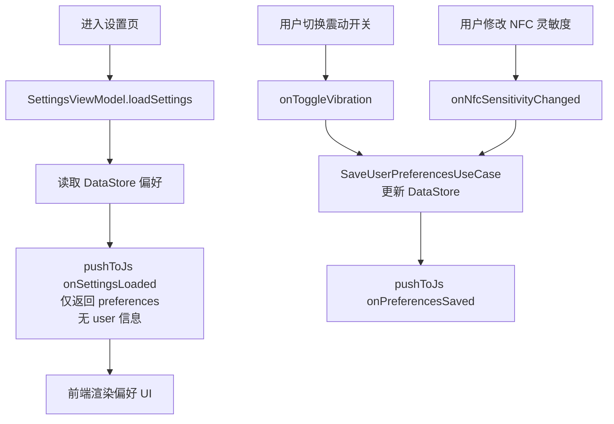
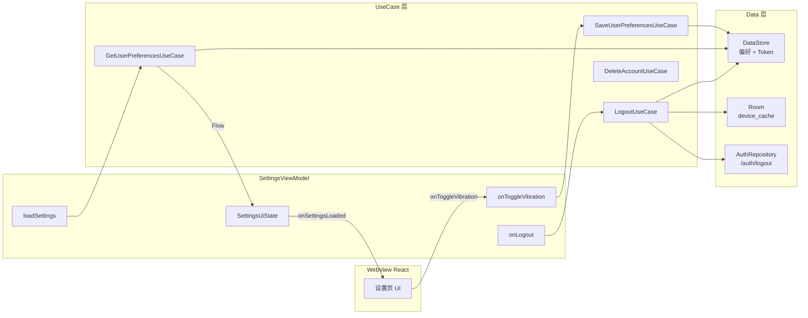

# 06 · 设置页模块：用户偏好 · 在线/离线模式 · 账号管理

> **模块边界**：用户偏好持久化（在线模式/震动/NFC灵敏度）、账号信息展示、修改密码入口、账号注销。  
> **依赖模块**：`08-storage`（DataStore 读写）、`02-auth`（登出/注销，Phase 2+）  
> **被依赖**：`07-webview-bridge`（设置事件调用）

---

## Phase 1：偏好设置（震动 + NFC 灵敏度）

### 职责范围

| 职责 | 说明 |
| :--- | :--- |
| 震动反馈开关 | DataStore 持久化 |
| NFC 灵敏度设置 | DataStore 持久化 |
| **跳过** | 登出、注销、修改密码入口、用户信息展示、在线模式 |

### 业务流程图



### 实现规格

#### SettingsViewModel（Phase 1 版）

```kotlin
@HiltViewModel
class SettingsViewModel @Inject constructor(
    private val getUserPreferencesUseCase: GetUserPreferencesUseCase,
    private val saveUserPreferencesUseCase: SaveUserPreferencesUseCase,
    // Phase 2+ 注入：private val logoutUseCase: LogoutUseCase,
    // Phase 2+ 注入：private val deleteAccountUseCase: DeleteAccountUseCase,
) : ViewModel() {

    private val _uiState = MutableStateFlow(SettingsUiState())
    val uiState: StateFlow<SettingsUiState> = _uiState.asStateFlow()

    init {
        viewModelScope.launch {
            getUserPreferencesUseCase().collect { prefs ->
                _uiState.update { it.copy(preferences = prefs) }
            }
        }
    }

    fun loadSettings() {
        // Phase 1：只加载偏好，不加载用户信息
        // user 保持 null，前端 onSettingsLoaded 仅含 preferences
    }

    fun onToggleVibration(enabled: Boolean) {
        viewModelScope.launch {
            saveUserPreferencesUseCase { copy(vibrationEnabled = enabled) }
        }
    }

    fun onNfcSensitivityChanged(level: String) {
        viewModelScope.launch {
            saveUserPreferencesUseCase { copy(nfcSensitivity = NfcSensitivity.fromString(level)) }
        }
    }

    // ======== Phase 2 Stub ========

    fun onToggleOnlineMode(enabled: Boolean) {
        // TODO("Phase 2: saveUserPreferencesUseCase { copy(onlineModeEnabled = enabled) }")
    }

    fun onLogout() {
        // TODO("Phase 2: logoutUseCase() → 清 Token + Room → UiState.LogoutDone")
    }

    fun onDeleteAccountClicked() {
        // TODO("Phase 2: _uiState.update { it.copy(showDeleteConfirmDialog = true) }")
    }

    fun confirmDeleteAccount() {
        // TODO("Phase 2: deleteAccountUseCase() → 清除全部数据 → UiState.DeleteDone")
    }

    fun dismissDeleteDialog() {
        // TODO("Phase 2: _uiState.update { it.copy(showDeleteConfirmDialog = false) }")
    }
}

data class SettingsUiState(
    val user: User? = null,                      // Phase 2+ 填充
    val preferences: UserPreferences = UserPreferences(),
    val isLoading: Boolean = false,
    val logoutState: LogoutState = LogoutState.Idle,
    val showDeleteConfirmDialog: Boolean = false
)
```

#### WebView 回调（Phase 1 版 onSettingsLoaded）

```json
// Phase 1：不含 user 字段
{
  "preferences": {
    "vibrationEnabled": true,
    "nfcSensitivity": "Medium"
  }
}

// Phase 2：含完整 user 字段
{
  "user": { "userId": "xxx", "username": "Alex", "phone": "138****8000", "role": "Owner" },
  "preferences": {
    "onlineModeEnabled": true,
    "vibrationEnabled": true,
    "nfcSensitivity": "Medium"
  }
}
```

### 验收要点（Phase 1）

- [ ] 进入设置页：偏好值正确从 DataStore 读取并展示
- [ ] 切换震动开关：DataStore 持久化，App 重启后值保留
- [ ] 修改 NFC 灵敏度：DataStore 持久化
- [ ] `onSettingsLoaded` 回调不含 user（前端不崩溃）
- [ ] 登出/注销按钮不出现或灰色占位（不触发崩溃）

---

## Phase 2：完整账号管理（登出 + 注销 + 用户信息）

### 新增 / 变更说明

| 变更项 | Phase 1 | Phase 2 |
| :--- | :--- | :--- |
| 用户信息 | 空 | 从 DataStore/内存读取，展示头像/用户名/角色/邮箱 |
| 登出 | stub | `LogoutUseCase` → 清 Token + Room → 跳登录页 |
| 账号注销 | stub | 二次确认 → `DeleteAccountUseCase` → 清除全部 |
| 修改密码入口 | 隐藏 | 跳转 UpdatePassword 页 |
| 在线模式开关 | stub | `SaveUserPreferencesUseCase { copy(onlineModeEnabled) }` |

### 数据流图



### 实现规格（Phase 2 完整 onLogout）

```kotlin
fun onLogout() {
    viewModelScope.launch {
        _uiState.update { it.copy(logoutState = LogoutState.Loading) }
        logoutUseCase()  // 通知云端 + 清 Token + 清 Room（网络失败也继续本地清除）
        _uiState.update { it.copy(logoutState = LogoutState.Done) }
        // SplashActivity 监听到 Done → 跳登录页
    }
}
```

### 验收要点（Phase 2）

- [ ] 登出：Token 清除，Room 设备缓存清除，跳转登录页
- [ ] 注销：二次确认弹窗，确认后清除全部数据，跳登录页
- [ ] 修改密码入口：跳转 UpdatePassword 页
- [ ] 在线模式 Toggle：DataStore 持久化
- [ ] 用户信息（头像/用户名/角色/邮箱）正确展示

---

## Phase 3：无新增

Phase 3 重点验收：

- [ ] 账号注销失败（网络断开）：提示错误，不清除本地数据
- [ ] 登出时网络失败：允许本地登出，云端吊销异步重试
- [ ] 设置页在 Token 失效后（强退场景）能正确跳登录页
