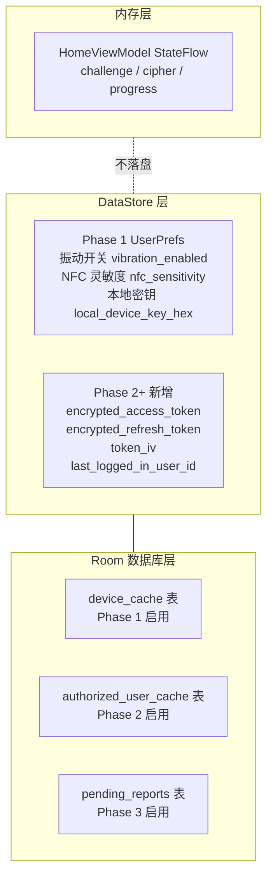
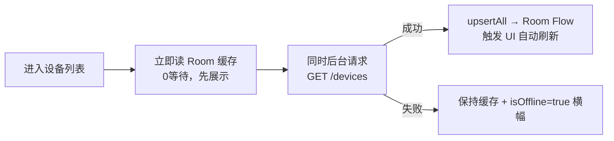
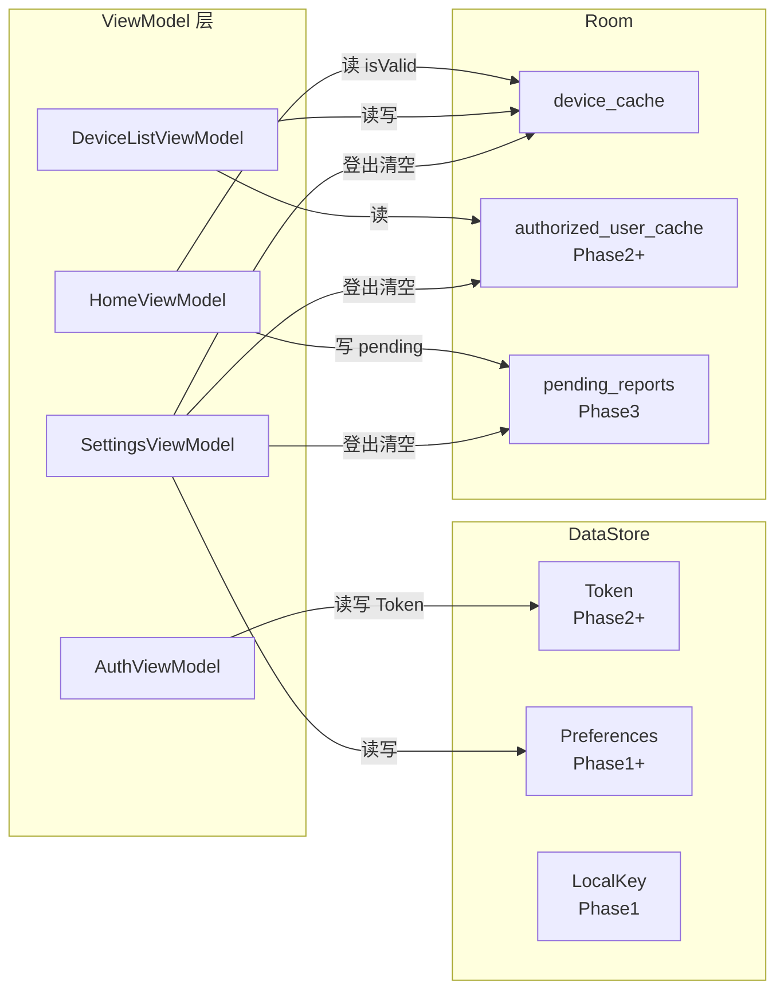

# 08 · 本地存储模块：Room 表设计 · DataStore · 缓存策略

> **模块边界**：所有持久化数据的结构设计和读写策略，是其他所有模块的基础设施。  
> **被依赖**：所有需要本地数据的模块（01/02/04/05/06/10）

---

## Phase 1：最小存储（设备缓存 + 偏好 + 本地密钥）

### 职责范围

| 职责 | 说明 |
| :--- | :--- |
| `device_cache` 表 | 存储本地调试设备列表 |
| DataStore 偏好 | 震动开关、NFC 灵敏度 |
| 本地加密密钥 | 存储 Phase 1 NFC 调试密钥（明文，仅调试） |
| **跳过** | `authorized_user_cache` 表、`pending_reports` 表、Token 加密存储 |

### 存储分层图



### Phase 1 精简 Proto 定义

**文件**：`app/src/main/proto/user_prefs.proto`

```protobuf
syntax = "proto3";
option java_package = "com.example.all";
option java_multiple_files = true;

// Phase 1 精简版：无 Token 字段
message UserPrefs {
  bool   vibration_enabled  = 1;   // 震动反馈开关，默认 true
  string nfc_sensitivity    = 2;   // "High" / "Medium" / "Low"，默认 "Medium"
  string local_device_key_hex = 3; // Phase 1 调试密钥（十六进制字符串）
                                   // ⚠️ 仅调试用，Phase 2 删除此字段
  // Phase 2+ 添加：
  // bytes  encrypted_access_token  = 4;
  // bytes  encrypted_refresh_token = 5;
  // bytes  token_iv                = 6;
  // string last_logged_in_user_id  = 7;
}
```

### Phase 1 Room 表：device_cache

**文件**：`data/local/entity/DeviceEntity.kt`

```kotlin
@Entity(tableName = "device_cache")
data class DeviceEntity(
    @PrimaryKey val deviceId: String,
    val nickname: String,
    val serialNo: String,
    val isValid: Int = 1,         // 1=有效，0=撤销（Phase 2 使用）
    val lastSyncAt: Long = System.currentTimeMillis()
)
```

**DeviceDao**：

```kotlin
@Dao
interface DeviceDao {
    @Query("SELECT * FROM device_cache ORDER BY nickname")
    fun observeAll(): Flow<List<DeviceEntity>>

    @Query("SELECT * FROM device_cache WHERE deviceId = :id")
    suspend fun getById(id: String): DeviceEntity?

    @Insert(onConflict = OnConflictStrategy.REPLACE)
    suspend fun upsertAll(devices: List<DeviceEntity>)

    @Insert(onConflict = OnConflictStrategy.REPLACE)
    suspend fun upsert(device: DeviceEntity)

    @Query("UPDATE device_cache SET isValid = 0 WHERE deviceId = :id")
    suspend fun markInvalid(id: String)

    @Query("DELETE FROM device_cache WHERE deviceId = :id")
    suspend fun deleteById(id: String)

    @Query("DELETE FROM device_cache")
    suspend fun deleteAll()
}
```

### 实现规格

#### DataStorePreferencesRepository（Phase 1 精简版）

```kotlin
class DataStorePreferencesRepository @Inject constructor(
    private val dataStore: DataStore<UserPrefs>
) : PreferencesRepository {

    override fun observePreferences(): Flow<UserPreferences> =
        dataStore.data.map { prefs ->
            UserPreferences(
                vibrationEnabled  = prefs.vibrationEnabled,
                nfcSensitivity    = NfcSensitivity.fromString(prefs.nfcSensitivity)
                // onlineModeEnabled: Phase 2 启用
            )
        }

    override suspend fun savePreferences(prefs: UserPreferences) {
        dataStore.updateData { current ->
            current.toBuilder()
                .setVibrationEnabled(prefs.vibrationEnabled)
                .setNfcSensitivity(prefs.nfcSensitivity.name)
                .build()
        }
    }

    // Phase 1 专用：读取本地调试密钥
    suspend fun getLocalDeviceKey(): String =
        dataStore.data.first().localDeviceKeyHex

    // Phase 1 专用：写入本地调试密钥（调试工具页面调用）
    suspend fun setLocalDeviceKey(keyHex: String) {
        dataStore.updateData { it.toBuilder().setLocalDeviceKeyHex(keyHex).build() }
    }

    // Phase 2+ 方法：stub
    override suspend fun saveTokens(tokens: AuthTokens) {
        // TODO("Phase 2: 使用 KeystoreManager 加密后写入 DataStore")
    }

    override suspend fun clearTokens() {
        // TODO("Phase 2: 清除 DataStore 中的 Token 字段")
    }

    override suspend fun clearAll() {
        // TODO("Phase 2: 清除所有 DataStore 字段")
    }
}
```

### 验收要点

- [ ] `device_cache` 表正常读写（Phase 1 设备列表可展示）
- [ ] DataStore 偏好（震动、NFC 灵敏度）能持久化
- [ ] 本地密钥能从 DataStore 读取，供 `LocalCryptoRepository` 使用
- [ ] App 重启后偏好不丢失

---

## Phase 2：完整存储（Token 加密 + 授权用户缓存）

### 新增 / 变更说明

| 变更项 | Phase 1 | Phase 2 |
| :--- | :--- | :--- |
| DataStore Token 字段 | 无 | `encrypted_access_token` / `encrypted_refresh_token` / `token_iv` |
| Token 存储方式 | 无 | AES-GCM + Android Keystore 加密 |
| `authorized_user_cache` 表 | 无 | 建立，用于设备详情授权用户展示 |
| `local_device_key_hex` 字段 | 存在（调试） | 移除 |

### 完整 Proto 定义（Phase 2）

```protobuf
message UserPrefs {
  bytes  encrypted_access_token  = 1;
  bytes  encrypted_refresh_token = 2;
  bytes  token_iv                = 3;
  bool   vibration_enabled       = 4;
  bool   online_mode_enabled     = 5;
  string nfc_sensitivity         = 6;
  string last_logged_in_user_id  = 7;
}
```

### authorized_user_cache 表

```kotlin
@Entity(tableName = "authorized_user_cache",
        indices = [Index("deviceId")])
data class AuthorizedUserEntity(
    @PrimaryKey(autoGenerate = true) val id: Int = 0,
    val userId: String,
    val deviceId: String,
    val name: String,
    val phone: String,   // 脱敏后的值（后四位）
    val role: String,    // "Owner" / "Guest"
    val lastSyncAt: Long
)
```

### 缓存策略

#### Cache-Then-Network（设备列表）



#### Network-First（授权用户列表）

```
进入设备详情 → 先展示 Room 缓存设备基本信息
             → 同时请求 GET /devices/{id}/users
               成功 → replaceForDevice() → 最新授权列表
               失败 → Room 缓存 + 错误提示
```

### 验收要点

- [ ] AccessToken / RefreshToken 加密存储（Keystore AES-GCM）
- [ ] Token 在不同设备间无法解密
- [ ] `authorized_user_cache` 按 deviceId 正确增删
- [ ] 登出时三表全部清空

---

## Phase 3：缓存时效规则

### 新增 / 变更说明

| 新增项 | 说明 |
| :--- | :--- |
| 缓存有效期校验 | `lastSyncAt` 距今超阈值则限制操作 |
| `pending_reports` 表 | 建立，Phase 3 写入中断操作记录 |

### 缓存有效期规则

| `lastSyncAt` 距今 | 行为 |
| :--- | :--- |
| < 24 小时 | 正常展示 |
| 24h ～ 7天 | 设备名旁显示"⚠ 数据较旧" |
| > 7 天 | 禁用操作按钮，提示"数据已过期，请联网刷新" |

### pending_reports 表

```kotlin
@Entity(tableName = "pending_reports")
data class PendingReportEntity(
    @PrimaryKey val operationId: String,
    val deviceId: String,
    val operationType: String,   // "Unlock" / "Lock"
    val result: String,          // "Cancelled" / "NetworkError" / "NfcError"
    val failedAtStep: Int,
    val createdAt: Long,
    val retryCount: Int = 0,
    val status: String = "pending"  // "pending" / "sent" / "expired"
)
```

### 验收要点

- [ ] `pending_reports` 写入、消费、幂等性验证
- [ ] 超 7 天缓存时操作按钮禁用，提示正确

---

## 各模块读写关系图


