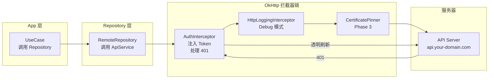
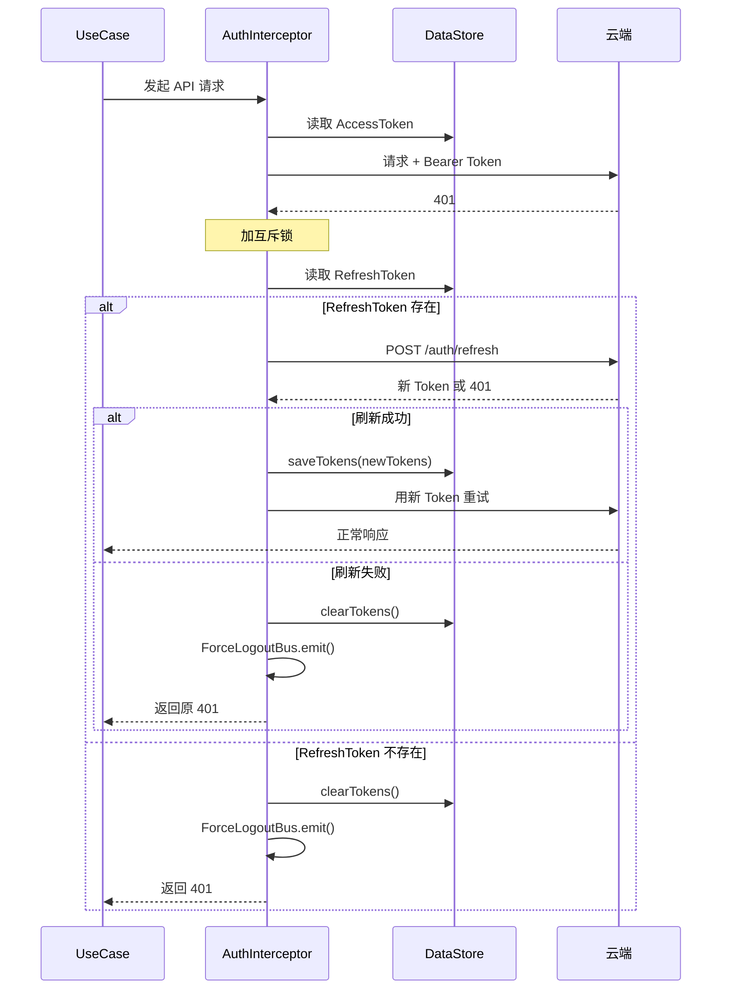

# 09 · 网络层：Retrofit 接口 · OkHttp 拦截器 · 错误码处理

> **模块边界**：所有 HTTP 通信的配置、接口定义、拦截器逻辑和错误映射。  
> **依赖模块**：`02-auth`（Token 管理，刷新逻辑）、`11-security`（证书固定，Phase 3）  
> **被依赖**：所有 RemoteRepository 实现

---

## Phase 1：不参与（全 Fake / 本地实现）

### 职责范围

Phase 1 整个网络层不参与，所有网络请求由 Fake/本地 Repository 替代。

| 组件 | Phase 1 处理 |
| :--- | :--- |
| OkHttpClient / Retrofit | 不初始化（或懒初始化不调用） |
| AuthInterceptor | 不使用（无 Token） |
| ApiService | 不调用 |
| 所有 RemoteRepository | 替换为 Fake/本地实现（见 `12-di.md`） |

### Fake Repository 骨架

**文件**：`data/fake/FakeCryptoRepository.kt`

```kotlin
// Phase 1 不使用此类（由 LocalCryptoRepository 替代）
// Phase 2 替换为 RemoteCryptoRepository
class FakeCryptoRepository @Inject constructor() : CryptoRepository {

    override suspend fun encryptLocal(challenge: ByteArray): Result<ByteArray> {
        // Phase 1 由 LocalCryptoRepository 实现，此类仅为 Phase 2 迁移准备
        throw UnsupportedOperationException("Use LocalCryptoRepository for Phase 1")
    }

    override suspend fun requestCipher(
        deviceId: String,
        challenge: ByteArray,
        operationType: OperationType
    ): Result<CipherResponse> {
        // 模拟云端加密（测试用），延迟 500ms
        delay(500)
        return Result.success(
            CipherResponse(
                operationId = UUID.randomUUID().toString(),
                cipher      = ByteArray(16) { 0xAA.toByte() } // 固定假密文
            )
        )
        // TODO("Phase 2: 替换为 RemoteCryptoRepository，调用 POST /crypto/encrypt")
    }

    override suspend fun reportResult(operationId: String, result: LockResult): Result<Unit> {
        delay(200)
        return Result.success(Unit)
        // TODO("Phase 2: 替换为 RemoteCryptoRepository，调用 POST /crypto/report")
    }
}
```

### 验收要点（Phase 1）

- [ ] 编译通过，不依赖网络权限初始化逻辑
- [ ] 所有 RemoteRepository 均已被 Fake/本地实现替代
- [ ] App 正常运行，无任何网络请求发出

---

## Phase 2：完整网络层（OkHttp + Retrofit + AuthInterceptor）

### 新增 / 变更说明

| 新增项 | 说明 |
| :--- | :--- |
| `OkHttpClient` | 超时配置 + 拦截器链 |
| `AuthInterceptor` | 自动注入 Token + 401 透明刷新 |
| `Retrofit` + `ApiService` | 全量 API 接口 |
| RemoteRepository × 4 | 替换所有 Fake 实现 |
| `NetworkMonitor` | 监听网络状态变化 |

### 请求拦截链路图



### OkHttp 配置

```kotlin
@Provides @Singleton
fun provideOkHttpClient(
    authInterceptor: AuthInterceptor,
    // Phase 3: certificatePinner: CertificatePinner
): OkHttpClient = OkHttpClient.Builder()
    .connectTimeout(10, TimeUnit.SECONDS)
    .readTimeout(10, TimeUnit.SECONDS)
    .writeTimeout(10, TimeUnit.SECONDS)
    .callTimeout(15, TimeUnit.SECONDS)
    .addInterceptor(authInterceptor)
    .addInterceptor(HttpLoggingInterceptor().apply {
        level = if (BuildConfig.DEBUG) HttpLoggingInterceptor.Level.BODY
                else HttpLoggingInterceptor.Level.NONE
    })
    // Phase 3: .certificatePinner(certificatePinner)
    .build()
```

### AuthInterceptor 实现

**文件**：`data/remote/AuthInterceptor.kt`

```kotlin
class AuthInterceptor @Inject constructor(
    private val preferencesRepository: PreferencesRepository
) : Interceptor {

    private val mutex = Mutex()

    override fun intercept(chain: Interceptor.Chain): Response {
        val token = runBlocking { preferencesRepository.getAccessToken() }
        val request = chain.request().newBuilder()
            .header("Authorization", "Bearer ${token ?: ""}")
            .build()
        val response = chain.proceed(request)

        if (response.code != 401) return response

        // 收到 401：透明刷新
        return runBlocking {
            mutex.withLock {
                // 再次检查 Token 是否已被其他协程刷新
                val currentToken = preferencesRepository.getAccessToken()
                if (currentToken != token) {
                    // 已刷新，重试
                    chain.proceed(
                        chain.request().newBuilder()
                            .header("Authorization", "Bearer $currentToken")
                            .build()
                    )
                } else {
                    tryRefreshAndRetry(chain, response)
                }
            }
        }
    }

    private suspend fun tryRefreshAndRetry(
        chain: Interceptor.Chain,
        original401: Response
    ): Response {
        val refreshToken = preferencesRepository.getRefreshToken()
            ?: return triggerForceLogout(original401)
        return try {
            // 调用 /auth/refresh（直接用 OkHttp，不走 Interceptor 防止循环）
            val newTokens = refreshTokenDirectly(refreshToken)
            preferencesRepository.saveTokens(newTokens)
            chain.proceed(
                chain.request().newBuilder()
                    .header("Authorization", "Bearer ${newTokens.accessToken}")
                    .build()
            )
        } catch (e: Exception) {
            triggerForceLogout(original401)
        }
    }

    private fun triggerForceLogout(response: Response): Response {
        runBlocking { preferencesRepository.clearTokens() }
        // 通过 ApplicationScope SharedFlow 广播强退事件
        ForceLogoutBus.emit(ForceLogoutEvent("登录状态已失效"))
        return response
    }
}
```

### Retrofit 接口定义（全量）

**文件**：`data/api/ApiService.kt`

```kotlin
interface ApiService {
    // === 认证 ===
    @POST("auth/login")
    suspend fun login(@Body req: LoginRequest): LoginResponse

    @POST("auth/logout")
    suspend fun logout()

    @POST("auth/refresh")
    suspend fun refreshToken(@Body req: RefreshRequest): TokenResponse

    @PUT("auth/password")
    suspend fun updatePassword(@Body req: UpdatePasswordRequest)

    @GET("auth/validate")
    suspend fun validateToken()

    @DELETE("auth/account")
    suspend fun deleteAccount()

    // === 设备管理 ===
    @GET("devices")
    suspend fun getDevices(): List<DeviceDto>

    @POST("devices/bind")
    suspend fun bindDevice(@Body req: BindDeviceRequest): DeviceDto

    @DELETE("devices/{deviceId}")
    suspend fun removeDevice(@Path("deviceId") deviceId: String)

    @GET("devices/{deviceId}")
    suspend fun getDeviceDetail(@Path("deviceId") deviceId: String): DeviceDetailDto

    @GET("devices/my")
    suspend fun getPermissionSnapshot(): List<PermissionSnapshotDto>

    // === 授权管理 ===
    @GET("devices/{deviceId}/users")
    suspend fun getAuthorizedUsers(@Path("deviceId") deviceId: String): List<AuthorizedUserDto>

    @POST("devices/{deviceId}/invite")
    suspend fun inviteUser(@Path("deviceId") deviceId: String, @Body req: InviteRequest)

    @DELETE("devices/{deviceId}/users/{userId}")
    suspend fun revokeUser(
        @Path("deviceId") deviceId: String,
        @Path("userId") userId: String
    )

    // === 加密 ===
    @POST("crypto/encrypt")
    suspend fun requestCipher(@Body req: EncryptRequest): EncryptResponse

    @POST("crypto/report")
    suspend fun reportResult(@Body req: ReportRequest)
}
```

### DTO 定义（网络传输对象）

```kotlin
// 请求体
data class LoginRequest(val phone: String, val password: String)
data class RefreshRequest(val refreshToken: String)
data class UpdatePasswordRequest(val currentPassword: String, val newPassword: String)
data class BindDeviceRequest(val deviceId: String, val nickname: String)
data class InviteRequest(val phone: String)
data class EncryptRequest(
    val deviceId: String,
    val challenge: String,      // Base64 编码
    val operationType: String   // "Unlock" / "Lock"
)
data class ReportRequest(
    val operationId: String,
    val success: Boolean,
    val errorCode: Int?,
    val mechanicalOk: Boolean?
)

// 响应体
data class LoginResponse(
    val userId: String, val username: String, val phone: String,
    val role: String, val email: String?,
    val accessToken: String, val refreshToken: String
)
data class TokenResponse(val accessToken: String, val refreshToken: String)
data class DeviceDto(
    val deviceId: String, val nickname: String, val serialNo: String,
    val isValid: Boolean, val updatedAt: Long
)
data class AuthorizedUserDto(
    val userId: String, val name: String, val phone: String, val role: String
)
data class EncryptResponse(val operationId: String, val cipher: String) // cipher: Base64
data class PermissionSnapshotDto(val deviceId: String, val isValid: Boolean)
```

### 错误码映射

| HTTP 状态码 | errorCode | 含义 | App 处理 |
| :--- | :--- | :--- | :--- |
| 200/201 | — | 成功 | 正常处理 |
| 400 | — | 参数错误 | 解析 `message` 展示 |
| 401 | — | Token 无效 | AuthInterceptor 透明刷新 |
| 403 | 4031 | 设备权限已撤销 | `markInvalid(deviceId)` + 禁用操作 |
| 403 | 4032 | 非 Owner 操作 | 提示「仅设备 Owner 可管理授权」 |
| 404 | — | 资源不存在 | 提示「该资源不存在或已被删除」 |
| 409 | — | 资源冲突 | 解析 message（如设备已绑定） |
| 5xx | — | 服务端错误 | 提示「服务器异常，请稍后重试」 |
| IOException | — | 网络不通 | 提示「网络不可用，请检查连接」 |

**统一错误响应体**：

```json
{ "errorCode": 4031, "message": "Permission revoked", "timestamp": 1700000000000 }
```

**ApiException**：

```kotlin
data class ApiException(val httpCode: Int, val errorCode: Int, val message: String) : Exception(message)
```

### 401 透明刷新时序图



### 验收要点（Phase 2）

- [ ] 正常请求：Token 自动注入，无感知
- [ ] AccessToken 过期：静默刷新，用户无感知
- [ ] RefreshToken 也过期：强退，提示文案正确
- [ ] 403（4031）：`markInvalid` 生效，设备列表实时灰化
- [ ] 网络断开：`IOException` 正确映射为用户提示
- [ ] 并发请求 401：互斥锁保证只刷新一次

---

## Phase 3：证书固定

### 新增 / 变更说明

| 新增项 | 说明 |
| :--- | :--- |
| `CertificatePinner` | 在 `NetworkModule.OkHttpClient` 中添加，绑定 API 域名证书 |

### 实现

```kotlin
// NetworkModule.kt 中添加
private fun buildCertPinner() = CertificatePinner.Builder()
    .add("api.your-domain.com", "sha256/AAAA...主证书指纹...=")
    .add("api.your-domain.com", "sha256/BBBB...备用证书指纹...=")  // 证书轮换预留
    .build()
```

详见 `11-security.md`。

### 验收要点（Phase 3）

- [ ] MITM 攻击（代理抓包）时，请求被正确拒绝（`SSLPeerUnverifiedException`）
- [ ] 正常 HTTPS 请求不受影响
