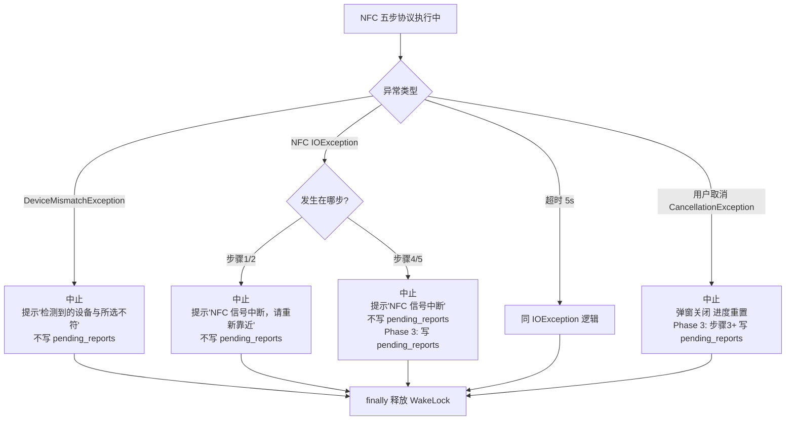
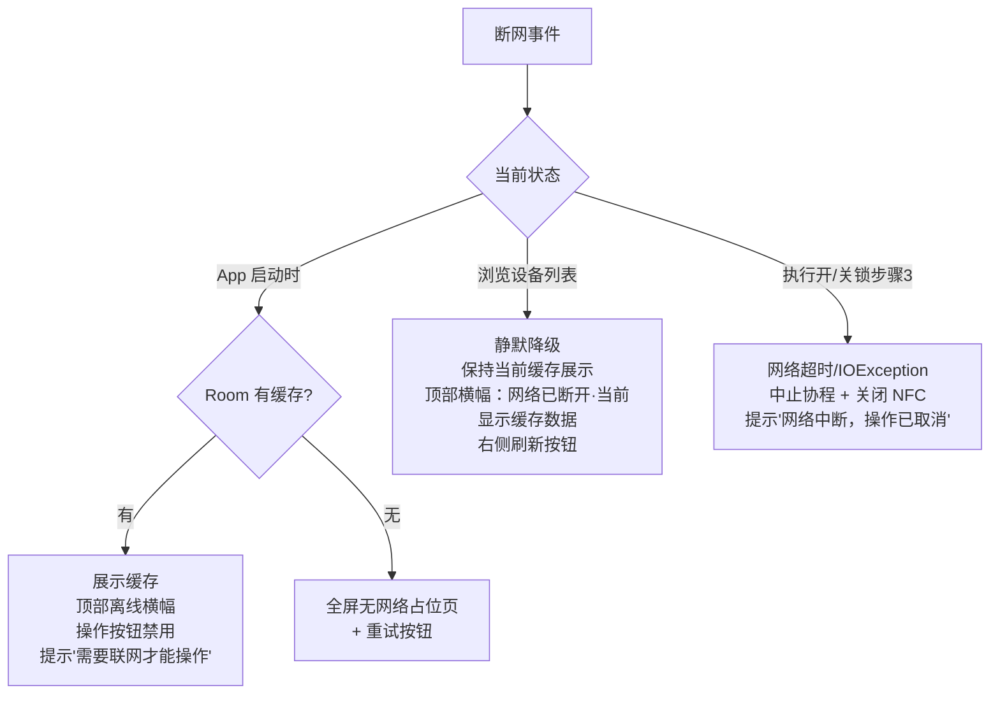
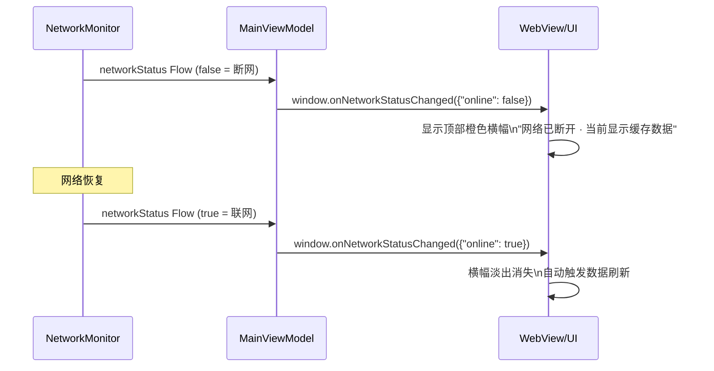
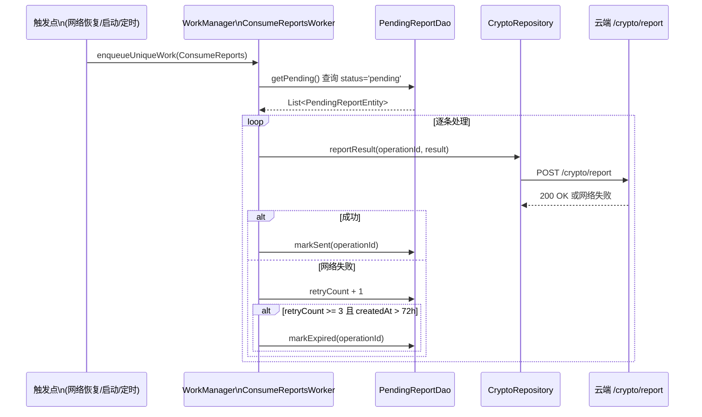

# 10 · 异常与边界处理：断网 · 待上报队列 · Token 失效 · 权限撤销

> **模块边界**：跨越多个模块的异常场景统一处理策略，以及 pending_reports 队列的完整消费机制。  
> **依赖模块**：`08-storage`（Room pending_reports）、`09-network`（NetworkMonitor）  
> **被依赖**：`03-nfc-core`（中止时写队列）、`01-startup`（启动时消费队列）

---

## Phase 1：NFC 异常处理（仅硬件层）

### 职责范围

| 职责 | 说明 |
| :--- | :--- |
| NFC IOException | 步骤1-5 任意时刻 NFC 断开 |
| NFC 超时（5s） | 步骤2/4/5 等待硬件响应超时 |
| 设备不符 | 步骤1 deviceId 不匹配 |
| 用户取消 | 用户点 Cancel → 协程取消 |
| WakeLock 释放保证 | `finally` 块确保释放 |
| **跳过** | 断网分级、pending_reports、Token 失效、权限撤销 |

### NFC 异常处理流程图



### HomeViewModel 异常处理（Phase 1 版）

```kotlin
// Phase 1：精简异常处理，无 pending_reports
private fun executeLockOperation(...) {
    lockJob = viewModelScope.launch {
        val wakeLock = acquireWakeLock()
        try {
            // 步骤1-5（见 03-nfc-core.md）
        } catch (e: DeviceMismatchException) {
            _uiState.update { it.copy(
                operationState = OperationState.Error("检测到的设备与所选不符", false)
            )}
        } catch (e: IOException) {
            _uiState.update { it.copy(
                operationState = OperationState.Error("NFC 信号中断，请重新靠近", true)
            )}
        } catch (e: TimeoutCancellationException) {
            _uiState.update { it.copy(
                operationState = OperationState.Error("NFC 响应超时，请重试", true)
            )}
        } catch (e: CancellationException) {
            _uiState.update { it.copy(operationState = OperationState.Idle) }
        } finally {
            wakeLock.release()  // 无论如何都释放
        }
    }
}
```

### 验收要点（Phase 1）

- [ ] NFC 断开时 UI 显示正确错误提示（非崩溃）
- [ ] 用户取消：弹窗关闭，进度条重置为 0
- [ ] 设备不符：提示后 NFC 流程中止
- [ ] 所有路径下 WakeLock 均被释放（无屏幕常亮泄漏）

---

## Phase 2：断网三场景 + Token 失效 + 权限撤销

### 新增 / 变更说明

| 新增场景 | 说明 |
| :--- | :--- |
| 启动时无网络 | 读 Room 缓存，顶部离线横幅，禁用操作按钮 |
| 浏览中断网 | 静默降级缓存，顶部持久横幅 |
| 开锁中断网（步骤3） | 中止流程，显示错误提示 |
| Token 失效 | AuthInterceptor 401 → 透明刷新 → 失败则强退 |
| 权限撤销（前台刷新） | `SyncPermissionsUseCase` → `markInvalid` → UI 灰化 |

### 断网三场景决策树



### 离线横幅数据流



### Token 失效完整链路

```mermaid
flowchart TD
    A[任意 API 请求 → 401] --> B[AuthInterceptor 尝试刷新]
    B --> C{RefreshToken 有效?}
    C -- 是 --> D[POST /auth/refresh → 新 Token\n重试原请求 → 用户无感知]
    C -- 否/超时 --> E[clearTokens\nForceLogoutBus.emit]
    E --> F[MainActivity 监听 ForceLogoutEvent]
    F --> G[window.onForceLogout\n{reason: '...'}]
    G --> H[前端跳登录页\n清除本地状态]
```

### 验收要点（Phase 2）

- [ ] 启动时断网 + 有缓存：顶部横幅，操作按钮正确禁用
- [ ] 启动时断网 + 无缓存：全屏提示 + 重试按钮
- [ ] 浏览中断网：横幅显示，不打断当前页面
- [ ] 网络恢复：横幅消失，数据自动刷新
- [ ] Token 失效：透明刷新成功时用户无感知
- [ ] Token 失效刷新失败：强退，提示文案正确
- [ ] 403（4031）：`markInvalid` + 设备灰化

---

## Phase 3：pending_reports 完整消费机制

### 新增 / 变更说明

| 新增项 | 说明 |
| :--- | :--- |
| `pending_reports` 写入 | NFC 步骤3+ 中断时写入 Room |
| `ConsumePendingReportsUseCase` | 逐条上报，成功标记 sent，失败重试 |
| WorkManager 三触发点 | 网络恢复 / App 启动 / 定期任务 |
| 幂等性保证 | 云端 `/crypto/report` 同一 operationId 只处理一次 |

### 写入时机

```kotlin
// HomeViewModel 协程 catch 块
} catch (e: Exception) {
    if (currentStep >= 3) {  // 步骤3+才需要上报
        pendingReportDao.insert(
            PendingReportEntity(
                operationId   = operationId,   // 协程开始时生成的 UUID
                deviceId      = deviceId,
                operationType = operationType.name,
                result        = e.toResultString(),  // "NetworkError" / "NfcError" / "Cancelled"
                failedAtStep  = currentStep,
                createdAt     = System.currentTimeMillis()
            )
        )
    }
}
```

### pending_reports 消费时序图



### WorkManager 三触发点

```kotlin
// 触发点1：网络恢复时（即时）
networkMonitor.isOnline.filter { it }.collect {
    WorkManager.getInstance(context).enqueueUniqueWork(
        "ConsumeReports",
        ExistingWorkPolicy.KEEP,
        OneTimeWorkRequestBuilder<ConsumeReportsWorker>().build()
    )
}

// 触发点2：App 启动时（SplashActivity 后台触发）
lifecycleScope.launch(Dispatchers.IO) {
    consumePendingReportsUseCase()
}

// 触发点3：定期后台（保险兜底）
val periodicRequest = PeriodicWorkRequestBuilder<ConsumeReportsWorker>(6, TimeUnit.HOURS).build()
WorkManager.getInstance(context).enqueueUniquePeriodicWork(
    "ConsumeReportsPeriodic",
    ExistingPeriodicWorkPolicy.KEEP,
    periodicRequest
)
```

### 全量异常分类表

| 异常类型 | 来源 | 处理方式 | 写 pending_reports |
| :--- | :--- | :--- | :--- |
| `DeviceMismatchException` | 步骤1 | 中止，提示 | 否 |
| NFC `IOException` | 步骤1-5 | 中止，提示 | 步骤3+ 写入 |
| NFC 超时（5s） | 步骤2/4/5 | 中止，提示 | 步骤3+ 写入 |
| 网络超时（10s） | 步骤3 | 中止，提示 | 是 |
| 网络断开 `IOException` | 步骤3 | 中止，提示 | 是 |
| `ApiException(403, 4031)` | 步骤3 | `markInvalid` + 中止 | 否 |
| `ApiException(401)` | 步骤3 | AuthInterceptor 处理 | 否 |
| 密文比对失败（0x01） | 步骤5 | reportResult(failure) | 否 |
| 机械检测失败（0x02） | 步骤5 | reportResult(failure) | 否 |
| 用户取消 | 任意 | 取消协程 | 步骤3+ 写入 |
| App 切后台 | 操作中 | onPause → NFC 断开 | 步骤3+ 写入 |
| `ValidationException` | 本地校验 | 直接展示 | 否 |

### 验收要点（Phase 3）

- [ ] 步骤3+ 中断：`pending_reports` 写入成功
- [ ] 网络恢复后：WorkManager 自动触发上报
- [ ] 同一 operationId 重复提交：云端幂等处理，不重复记录
- [ ] 超 72h + retryCount >= 3：`status='expired'`，不再重试
- [ ] App 切后台（NFC 断开）：步骤3+ 情况下 pending_reports 写入
- [ ] 定期任务（6h）：能正常消费积压记录
