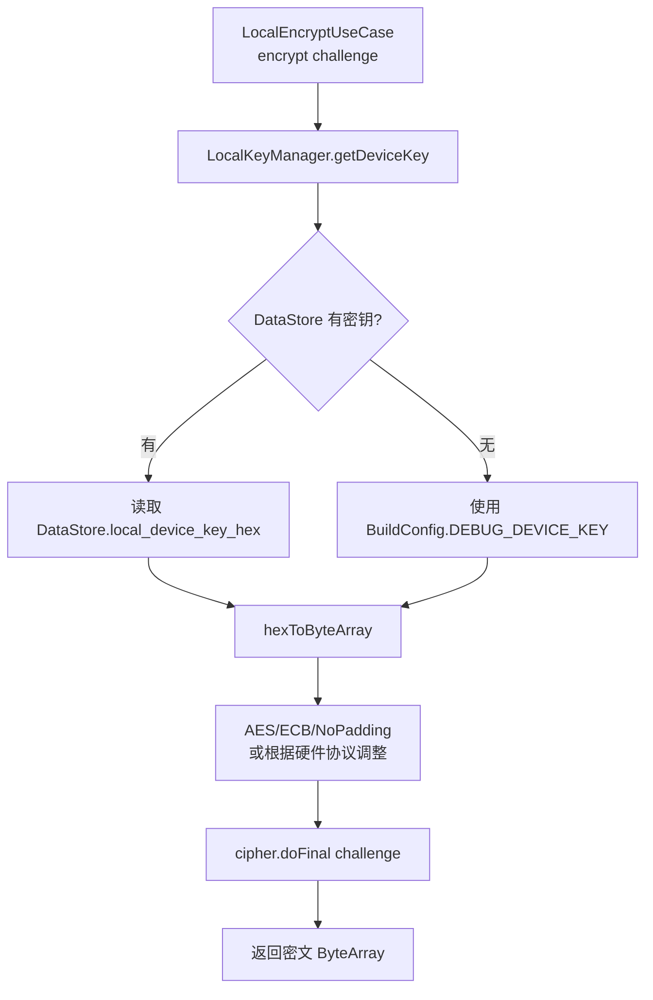
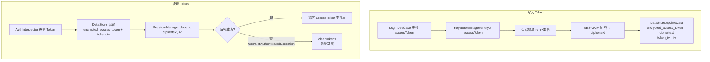
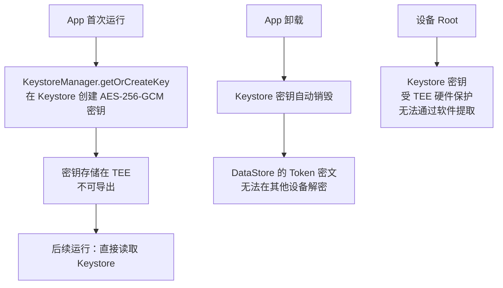

# 11 · 安全加固：本地密钥管理 · Token 加密存储 · 证书固定

> **模块边界**：所有安全相关基础设施，为网络层和存储层提供加密能力。  
> **依赖模块**：无（基础设施层）  
> **被依赖**：`09-network`（证书固定，Phase 3）、`08-storage`（Token 加密）、`02-auth`（Token 存取）

---

## Phase 1：本地密钥管理（调试密钥，明文存储）

### 职责范围

| 职责 | 说明 |
| :--- | :--- |
| 本地调试密钥存储 | 供 `LocalCryptoRepository` 读取，用于 NFC challenge 加密 |
| 密钥来源 | BuildConfig 硬编码 或 DataStore 明文字段 |
| **跳过** | Android Keystore Token 加密、证书固定 |

> **注意**：Phase 1 的密钥存储方式仅用于调试，不可用于生产。Phase 2 后密钥管理交由云端（HSM/安全数据库），本地不再存储设备密钥。

### 本地密钥工具类骨架

**文件**：`data/local/security/LocalKeyManager.kt`

```kotlin
class LocalKeyManager @Inject constructor(
    private val preferencesRepository: PreferencesRepository
) {
    companion object {
        // Phase 1 调试密钥（16 字节 AES-128，仅用于测试）
        // 生产环境：从云端获取，不在本地存储
        const val DEFAULT_DEBUG_KEY_HEX = BuildConfig.DEBUG_DEVICE_KEY
        // BuildConfig.DEBUG_DEVICE_KEY 在 build.gradle 中配置：
        // buildConfigField("String", "DEBUG_DEVICE_KEY", "\"0123456789abcdef0123456789abcdef\"")
    }

    // 从 DataStore 读取密钥（支持运行时更新，方便调试不同设备）
    suspend fun getDeviceKey(): ByteArray {
        val keyHex = preferencesRepository.getLocalDeviceKey()
            .ifBlank { DEFAULT_DEBUG_KEY_HEX }
        return keyHex.hexToByteArray()
    }

    // 调试工具：通过设置页更新密钥（仅 Debug 构建暴露）
    suspend fun updateDeviceKey(keyHex: String) {
        require(keyHex.length == 32 || keyHex.length == 64) {
            "密钥长度必须为 32（AES-128）或 64（AES-256）个十六进制字符"
        }
        preferencesRepository.setLocalDeviceKey(keyHex)
    }
}

// 扩展函数：十六进制字符串 → ByteArray
fun String.hexToByteArray(): ByteArray {
    check(length % 2 == 0) { "十六进制字符串长度必须为偶数" }
    return ByteArray(length / 2) { i ->
        substring(i * 2, i * 2 + 2).toInt(16).toByte()
    }
}
```

### Phase 1 本地加密流程图



### 验收要点（Phase 1）

- [ ] `LocalKeyManager.getDeviceKey()` 能正确返回密钥字节
- [ ] BuildConfig.DEBUG_DEVICE_KEY 已在 `build.gradle` 中配置
- [ ] 密钥正确时，NAC1080 硬件验证通过（开/关锁成功）
- [ ] 密钥错误时，NAC1080 返回 0x01 比对失败（UI 正确提示）

---

## Phase 2：Token 加密存储（Android Keystore AES-GCM）

### 新增 / 变更说明

| 新增项 | 说明 |
| :--- | :--- |
| `KeystoreManager` | 在 Android Keystore 中创建/使用 AES-256-GCM 密钥 |
| Token 加密写入 | 每次 saveTokens 生成新 IV，加密后存 DataStore |
| Token 解密读取 | 读取时用 Keystore 密钥解密 |
| `local_device_key_hex` 字段移除 | Phase 2 设备密钥由云端管理，不在本地存储 |

### KeystoreManager 实现

**文件**：`data/local/security/KeystoreManager.kt`

```kotlin
class KeystoreManager @Inject constructor() {
    companion object {
        private const val KEY_ALIAS     = "nac1080_token_key"
        private const val KEY_STORE     = "AndroidKeyStore"
        private const val ALGORITHM     = KeyProperties.KEY_ALGORITHM_AES
        private const val BLOCK_MODE    = KeyProperties.BLOCK_MODE_GCM
        private const val PADDING       = KeyProperties.ENCRYPTION_PADDING_NONE
        private const val TRANSFORMATION = "$ALGORITHM/$BLOCK_MODE/$PADDING"
        private const val GCM_TAG_LENGTH = 128
    }

    private fun getOrCreateKey(): SecretKey {
        val keyStore = KeyStore.getInstance(KEY_STORE).apply { load(null) }
        return if (keyStore.containsAlias(KEY_ALIAS)) {
            (keyStore.getEntry(KEY_ALIAS, null) as KeyStore.SecretKeyEntry).secretKey
        } else {
            val keyGen = KeyGenerator.getInstance(ALGORITHM, KEY_STORE)
            keyGen.init(
                KeyGenParameterSpec.Builder(KEY_ALIAS,
                    KeyProperties.PURPOSE_ENCRYPT or KeyProperties.PURPOSE_DECRYPT)
                    .setBlockModes(BLOCK_MODE)
                    .setEncryptionPaddings(PADDING)
                    .setKeySize(256)
                    // .setIsStrongBoxBacked(true)  // API 28+，设备支持时启用
                    .build()
            )
            keyGen.generateKey()
        }
    }

    fun encrypt(plaintext: String): Pair<ByteArray, ByteArray> {
        val key = getOrCreateKey()
        val cipher = Cipher.getInstance(TRANSFORMATION)
        cipher.init(Cipher.ENCRYPT_MODE, key)
        val iv         = cipher.iv          // AES-GCM 随机 IV（12 字节）
        val ciphertext = cipher.doFinal(plaintext.toByteArray(Charsets.UTF_8))
        return Pair(ciphertext, iv)
    }

    fun decrypt(ciphertext: ByteArray, iv: ByteArray): String {
        val key = getOrCreateKey()
        val cipher = Cipher.getInstance(TRANSFORMATION)
        val spec = GCMParameterSpec(GCM_TAG_LENGTH, iv)
        cipher.init(Cipher.DECRYPT_MODE, key, spec)
        return String(cipher.doFinal(ciphertext), Charsets.UTF_8)
    }
}
```

### Token 加密存储流程图



### 密钥生命周期图



### 验收要点（Phase 2）

- [ ] Token 写入：DataStore 中存储的是密文（非明文 JWT）
- [ ] Token 读取：每次解密成功，返回明文 JWT
- [ ] 设备迁移：将 DataStore 文件拷贝到另一台设备，无法解密
- [ ] 密钥丢失（极罕见）：catch 异常 → 清 Token → 跳登录页（不崩溃）
- [ ] App 重启后 Token 可正常读取（密钥持久化在 Keystore）

---

## Phase 3：证书固定（Certificate Pinning）

### 新增 / 变更说明

| 新增项 | 说明 |
| :--- | :--- |
| `CertificatePinner` | 在 OkHttp 中配置，防止 MITM 攻击 |
| 证书指纹获取 | openssl 命令获取 SHA-256 公钥指纹 |
| 轮换策略 | 同时配置主证书 + 备用证书，提前 30 天更新 |

### 证书固定实现

```kotlin
// NetworkModule.kt 中添加
private fun buildCertificatePinner() = CertificatePinner.Builder()
    .add("api.your-domain.com",
        "sha256/AAAAAAAAAAAAAAAAAAAAAAAAAAAAAAAAAAAAAAAAAAA=")   // 主证书
    .add("api.your-domain.com",
        "sha256/BBBBBBBBBBBBBBBBBBBBBBBBBBBBBBBBBBBBBBBBBBB=")   // 备用（证书轮换预留）
    .build()
```

### 获取证书指纹命令

```bash
openssl s_client -connect api.your-domain.com:443 < /dev/null 2>/dev/null \
  | openssl x509 -pubkey -noout \
  | openssl pkey -pubin -outform der \
  | openssl dgst -sha256 -binary \
  | base64
```

### 证书固定异常处理

```kotlin
// Repository 层捕获
catch (e: SSLPeerUnverifiedException) {
    Result.failure(SecurityException("网络连接不安全，请检查是否处于可信网络环境"))
}
```

> **安全原则**：证书校验失败时绝不降级（不跳过验证），直接提示用户。

### 安全检查清单

| 检查项 | 实现位置 | Phase |
| :--- | :--- | :--- |
| 本地调试密钥可配置 | `LocalKeyManager` + DataStore | Phase 1 |
| HTTPS 全站 | OkHttp 默认行为 | Phase 2 |
| Token 加密存储 | `KeystoreManager` + DataStore | Phase 2 |
| NFC Challenge 不落盘 | HomeViewModel 协程局部变量 | Phase 1+ |
| NFC 密文不落盘 | 同上 | Phase 1+ |
| adb backup 防护 | `AndroidManifest allowBackup="false"` | Phase 1+ |
| 手机号脱敏展示 | Room/UI 仅存储/展示后四位 | Phase 2+ |
| 证书固定 | `NetworkModule` CertificatePinner | Phase 3 |
| 混淆（R8） | `build.gradle` release minify | Phase 2+ |

### 验收要点（Phase 3）

- [ ] 代理工具抓包：HTTPS 请求被 `SSLPeerUnverifiedException` 拒绝
- [ ] 正常 HTTPS 请求：证书验证通过，请求正常
- [ ] 证书轮换：新版本 App 能正确识别新旧证书（任一通过即可）
- [ ] 证书过期前 30 天：App 已发布包含新备用证书的版本
