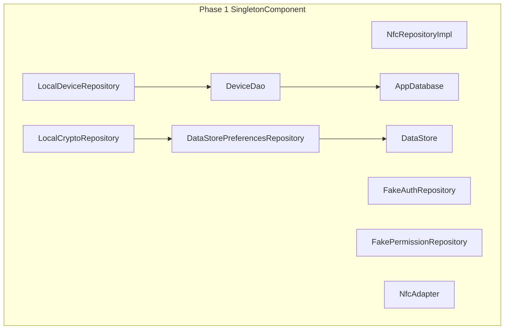
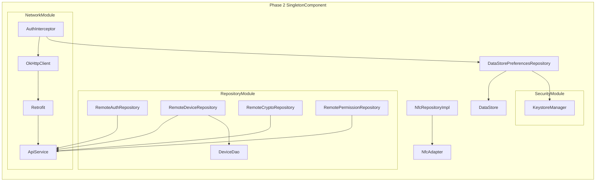

# 12 · 依赖注入：Hilt 模块划分 · 三阶段绑定策略

> **模块边界**：整个项目的对象创建和依赖装配，是连接所有模块的"胶水层"。  
> **依赖模块**：所有其他模块（提供它们的实现类）  
> **被依赖**：无（最顶层的基础设施）

---

## Phase 1：本地绑定（Fake / 本地实现）

### 职责范围

| 职责 | 说明 |
| :--- | :--- |
| `RepositoryModule` | 所有 Repository 绑定 Fake/本地实现 |
| `DatabaseModule` | 提供 AppDatabase + DeviceDao（device_cache） |
| `PreferencesModule` | 提供 DataStore（精简 Phase 1 版） |
| `NfcModule` | 提供 NfcAdapter |
| **跳过** | `NetworkModule`（无网络层）、`SecurityModule`（无 Keystore Token 加密） |

### Phase 1 完整 RepositoryModule

**文件**：`di/RepositoryModule.kt`

```kotlin
@Module
@InstallIn(SingletonComponent::class)
abstract class RepositoryModule {

    // Phase 1：本地加密，不请求网络
    @Binds @Singleton
    abstract fun bindCryptoRepository(
        impl: LocalCryptoRepository
    ): CryptoRepository

    // Phase 1：本地设备列表（Room 直接读写，无云端）
    @Binds @Singleton
    abstract fun bindDeviceRepository(
        impl: LocalDeviceRepository
    ): DeviceRepository

    // Phase 1：不参与认证，返回固定 stub
    @Binds @Singleton
    abstract fun bindAuthRepository(
        impl: FakeAuthRepository
    ): AuthRepository

    // Phase 1：权限管理不参与
    @Binds @Singleton
    abstract fun bindPermissionRepository(
        impl: FakePermissionRepository
    ): PermissionRepository

    // Phase 1：NFC 真实实现（硬件调试核心）
    @Binds @Singleton
    abstract fun bindNfcRepository(
        impl: NfcRepositoryImpl
    ): NfcRepository

    // Phase 1：DataStore 偏好（精简版，无 Token）
    @Binds @Singleton
    abstract fun bindPreferencesRepository(
        impl: DataStorePreferencesRepository
    ): PreferencesRepository
}
```

### Phase 1 Fake 实现骨架

#### FakeAuthRepository

```kotlin
class FakeAuthRepository @Inject constructor() : AuthRepository {

    override suspend fun login(phone: String, password: String): Pair<User, AuthTokens> {
        // TODO("Phase 2: 调用 POST /auth/login")
        // Phase 1 直接返回固定用户（不会被调用，因为无登录页）
        return Pair(
            User("debug-user", "13800000000", "Debug User", UserRole.Owner),
            AuthTokens("fake-access-token", "fake-refresh-token")
        )
    }

    override suspend fun logout(): Unit {
        // TODO("Phase 2: 调用 POST /auth/logout")
        // Phase 1 静默忽略
    }

    override suspend fun refreshToken(refreshToken: String): AuthTokens {
        // TODO("Phase 2: 调用 POST /auth/refresh")
        throw UnsupportedOperationException("Phase 2")
    }

    override suspend fun updatePassword(current: String, new: String): Unit {
        // TODO("Phase 2: 调用 PUT /auth/password")
        throw UnsupportedOperationException("Phase 2")
    }

    override suspend fun deleteAccount(): Unit {
        // TODO("Phase 2: 调用 DELETE /auth/account")
        throw UnsupportedOperationException("Phase 2")
    }
}
```

#### LocalDeviceRepository

```kotlin
class LocalDeviceRepository @Inject constructor(
    private val deviceDao: DeviceDao
) : DeviceRepository {

    override fun observeDevices(): Flow<List<Device>> =
        deviceDao.observeAll().map { list -> list.map { it.toDomain() } }

    override suspend fun fetchAndCacheDevices(): Unit {
        // TODO("Phase 2: GET /devices，写入 Room")
        // Phase 1：无网络，Room 数据由本地操作维护
    }

    override suspend fun addDevice(deviceId: String, nickname: String): Device {
        // Phase 1：直接写 Room，不调云端
        val entity = DeviceEntity(
            deviceId  = deviceId,
            nickname  = nickname,
            serialNo  = "SN-$deviceId",
            isValid   = 1,
            lastSyncAt = System.currentTimeMillis()
        )
        deviceDao.upsert(entity)
        return entity.toDomain()
        // TODO("Phase 2: 同时调用 POST /devices/bind")
    }

    override suspend fun removeDevice(deviceId: String): Unit {
        deviceDao.deleteById(deviceId)
        // TODO("Phase 2: 同时调用 DELETE /devices/{deviceId}")
    }

    override suspend fun clearLocalCache(): Unit = deviceDao.deleteAll()

    override suspend fun markInvalid(deviceId: String): Unit = deviceDao.markInvalid(deviceId)

    override suspend fun getDeviceDetail(deviceId: String): Pair<Device, List<AuthorizedUser>> {
        val device = deviceDao.getById(deviceId)?.toDomain()
            ?: throw NoSuchElementException("Device $deviceId not found")
        return Pair(device, emptyList()) // Phase 1：无授权用户
        // TODO("Phase 2: 调用 GET /devices/{id}，返回授权用户列表")
    }
}
```

#### FakePermissionRepository

```kotlin
class FakePermissionRepository @Inject constructor() : PermissionRepository {

    override suspend fun inviteUser(deviceId: String, phone: String): Unit {
        // TODO("Phase 2: POST /devices/{deviceId}/invite")
        throw UnsupportedOperationException("Phase 2")
    }

    override suspend fun revokeUser(deviceId: String, userId: String): Unit {
        // TODO("Phase 2: DELETE /devices/{deviceId}/users/{userId}")
        throw UnsupportedOperationException("Phase 2")
    }

    override suspend fun fetchPermissionSnapshot(): List<PermissionSnapshot> {
        // TODO("Phase 2: GET /devices/my")
        return emptyList() // Phase 1：静默返回空列表
    }
}
```

### Phase 1 依赖图



### 验收要点

- [ ] Phase 1 编译通过，所有 Repository 注入正常
- [ ] `LocalDeviceRepository` 能读写 Room，设备列表正常显示
- [ ] `LocalCryptoRepository` 注入后能执行本地加密
- [ ] `FakeAuthRepository` 不发起网络请求

---

## Phase 2：网络绑定（Remote 实现）

### 新增 / 变更说明

| 绑定项 | Phase 1 | Phase 2 |
| :--- | :--- | :--- |
| `AuthRepository` | `FakeAuthRepository` | `RemoteAuthRepository` |
| `DeviceRepository` | `LocalDeviceRepository` | `RemoteDeviceRepository` |
| `CryptoRepository` | `LocalCryptoRepository` | `RemoteCryptoRepository` |
| `PermissionRepository` | `FakePermissionRepository` | `RemotePermissionRepository` |
| 新增 | — | `NetworkModule`（OkHttp+Retrofit）、`SecurityModule`（Keystore） |

### Phase 2 完整 RepositoryModule

```kotlin
@Module
@InstallIn(SingletonComponent::class)
abstract class RepositoryModule {

    @Binds @Singleton
    abstract fun bindAuthRepository(
        impl: RemoteAuthRepository
    ): AuthRepository

    @Binds @Singleton
    abstract fun bindDeviceRepository(
        impl: RemoteDeviceRepository
    ): DeviceRepository

    @Binds @Singleton
    abstract fun bindCryptoRepository(
        impl: RemoteCryptoRepository
    ): CryptoRepository

    @Binds @Singleton
    abstract fun bindPermissionRepository(
        impl: RemotePermissionRepository
    ): PermissionRepository

    @Binds @Singleton
    abstract fun bindNfcRepository(
        impl: NfcRepositoryImpl
    ): NfcRepository

    @Binds @Singleton
    abstract fun bindPreferencesRepository(
        impl: DataStorePreferencesRepository
    ): PreferencesRepository
}
```

### Phase 2 新增模块

#### NetworkModule

```kotlin
@Module
@InstallIn(SingletonComponent::class)
object NetworkModule {

    @Provides @Singleton
    fun provideOkHttpClient(authInterceptor: AuthInterceptor): OkHttpClient =
        OkHttpClient.Builder()
            .connectTimeout(10, TimeUnit.SECONDS)
            .readTimeout(10, TimeUnit.SECONDS)
            .callTimeout(15, TimeUnit.SECONDS)
            .addInterceptor(authInterceptor)
            // Phase 3 添加：.certificatePinner(buildCertPinner())
            .build()

    @Provides @Singleton
    fun provideRetrofit(client: OkHttpClient): Retrofit =
        Retrofit.Builder()
            .baseUrl(BuildConfig.API_BASE_URL)
            .client(client)
            .addConverterFactory(GsonConverterFactory.create())
            .build()

    @Provides @Singleton
    fun provideApiService(retrofit: Retrofit): ApiService =
        retrofit.create(ApiService::class.java)
}
```

#### SecurityModule

```kotlin
@Module
@InstallIn(SingletonComponent::class)
object SecurityModule {
    @Provides @Singleton
    fun provideKeystoreManager(): KeystoreManager = KeystoreManager()
}
```

### Phase 2 依赖图



### 验收要点

- [ ] Phase 2 只改 `RepositoryModule` 绑定，ViewModel / UseCase 层零改动
- [ ] `RemoteAuthRepository` 能成功调用 `/auth/login`
- [ ] `AuthInterceptor` 自动注入 Token，401 时透明刷新

---

## Phase 3：安全加固

### 新增 / 变更说明

| 新增项 | 说明 |
| :--- | :--- |
| `CertificatePinner` | 在 `NetworkModule.OkHttpClient` 中添加（见 `11-security.md`） |
| 无其他 DI 变化 | Phase 3 不新增模块，只在现有模块中启用安全配置 |

### 验收要点

- [ ] 证书固定后，MITM 攻击的 HTTPS 请求被正确拒绝
- [ ] `SSLPeerUnverifiedException` 能被正确捕获并提示用户

---

## ViewModel 注入（各阶段通用）

```kotlin
@HiltViewModel
class HomeViewModel @Inject constructor(
    private val sendIntentionBitUseCase: SendIntentionBitUseCase,
    private val receiveChallengeUseCase: ReceiveChallengeUseCase,
    // Phase 1：localEncryptUseCase；Phase 2：requestCipherUseCase（通过接口注入自动切换）
    private val cryptoRepository: CryptoRepository,
    private val sendCipherToLockUseCase: SendCipherToLockUseCase,
    private val receiveLockResultUseCase: ReceiveLockResultUseCase,
) : ViewModel()
```

UseCase 通过 `@Inject constructor` 注入接口，接口实现由 `RepositoryModule` 绑定，各阶段切换只需修改 `RepositoryModule`，ViewModel 和 UseCase 层无需改动。
