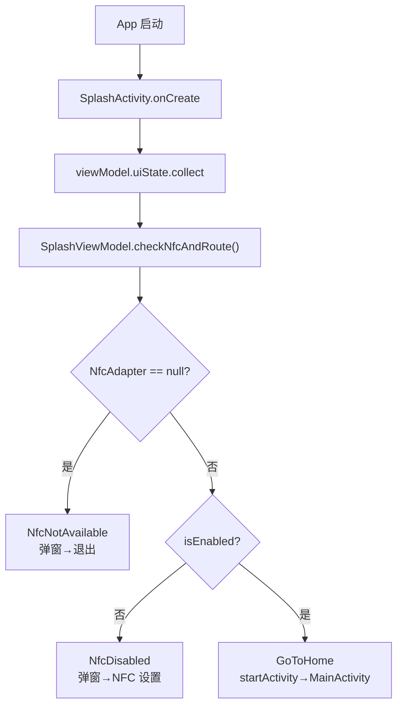
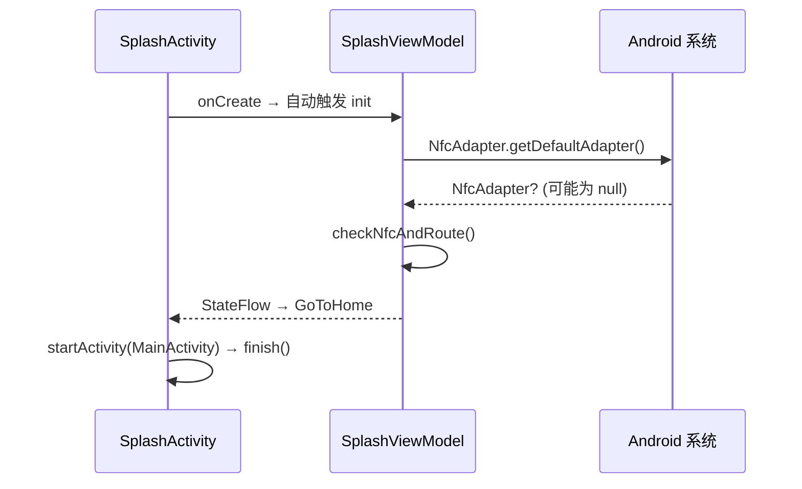

# 01 启动模块 Phase 1 实现总结

## 功能概述

App 冷启动时检测 NFC 硬件状态，根据结果决定路由：
- NFC 不存在 → 弹窗退出
- NFC 未开启 → 引导去设置
- NFC 可用 → 直接进入首页（无 Token 判断）

## 调用流程

## 数据流

## 涉及文件

| 文件 | 职责 |
|:-----|:-----|
| `ui/SplashActivity.kt` | 收集状态、显示弹窗、执行跳转 |
| `presentation/splash/SplashViewModel.kt` | NFC 检测逻辑、状态管理 |
| `di/NfcModule.kt` | 提供 NfcAdapter 实例 |

## 设计理由

1. **ViewModel 分离**：NFC 检测逻辑放在 ViewModel 而非 Activity 中，便于单元测试（Mock NfcAdapter）。
2. **StateFlow 驱动**：Activity 只负责 collect 和跳转，不含业务逻辑——符合单向数据流原则。
3. **recheckNfc()**：用户从系统设置返回后调用，避免"开了 NFC 但还停在弹窗"的体验问题。

## Phase 2 演进

- `checkNfcAndRoute()` 中 NFC 可用后增加 Token 判断
- 注入 `ValidateTokenUseCase` 和 `RefreshTokenUseCase`
- 新增 `GoToLogin` 路由分支
- 增加 3 秒整体超时保护
