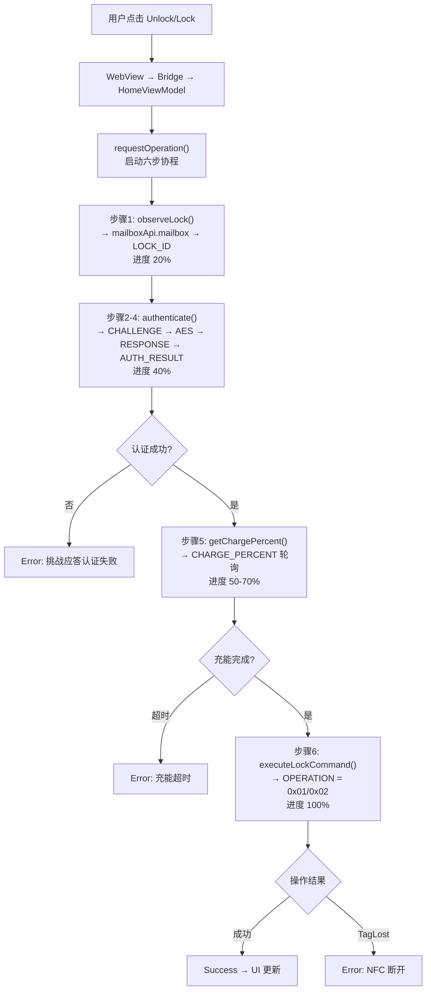
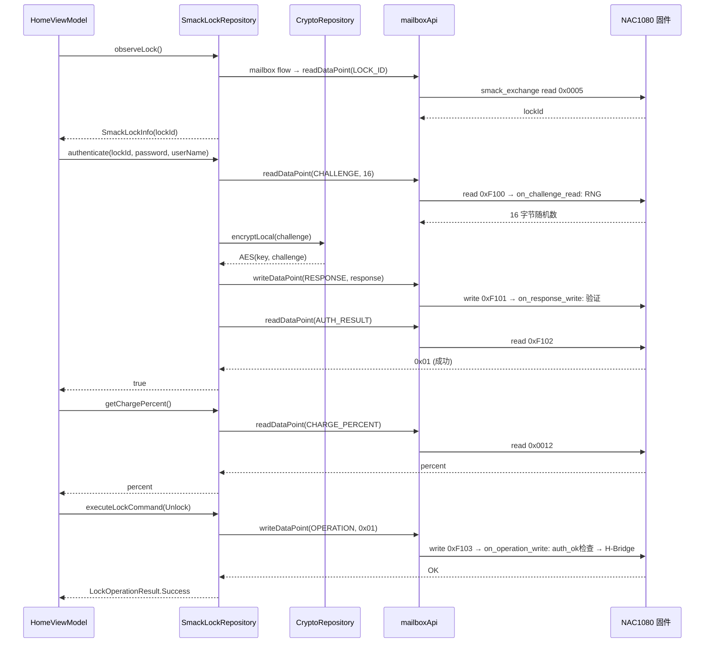
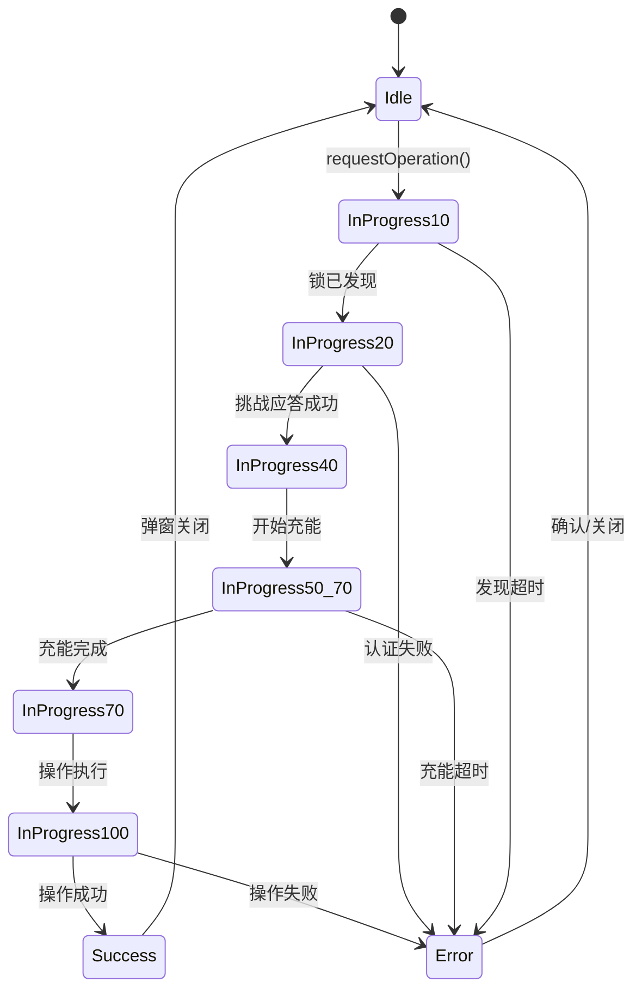

# 03 NFC 核心模块 Phase 1 实现总结

## 功能概述

基于 SmAcK SDK `mailboxApi` 实现挑战应答开/关锁协议（替代原 lockApi 静态 AES 加密）：
1. 发现锁 → `mailboxApi.mailbox` → 读 LOCK_ID
2. 挑战 → 读 CHALLENGE → 固件 RNG 生成 16 字节随机数
3. 应答 → `CryptoRepository.encryptLocal(challenge)` → AES(key, challenge) → 写 RESPONSE
4. 确认 → 读 AUTH_RESULT → 0x01 = 成功
5. 充能 → 轮询 CHARGE_PERCENT → ≥80% 放行
6. 执行 → 写 OPERATION = 0x01/0x02 → 固件 auth_ok 检查 → 驱动电机

## 架构变更（与 lockApi 版本对比）

| 方面 | lockApi 版本 | 挑战应答版本 |
|:-----|:------------|:------------|
| SDK 层 | `lockApi` (SmackLockApi) | `mailboxApi` (SmackMailboxApi) |
| 认证方式 | 静态 AES 对称加密（无防重放） | 硬件 RNG 挑战 + AES 应答（防重放） |
| 数据点加密 | `data_point_encrypt` 传输层加密 | 全明文传输，应用层安全 |
| 进度步骤 | 4 步 (20→40→70→100%) | 6 步 (authenticate 内含 2-4) |
| 新增依赖 | 无 | `CryptoRepository` (AES 加密) |
| 安全等级 | 防窃听，不防重放 | 防窃听 + 防重放 + 恒时比较 |

## 调用流程

## 数据流

## 进度状态机

## 涉及文件

| 文件 | 职责 | 状态 |
|:-----|:-----|:-----|
| `data/nfc/AresDataPoints.kt` | 自定义数据点定义（CHALLENGE, RESPONSE 等） | **新增** |
| `data/nfc/SmackLockRepository.kt` | mailboxApi 挑战应答实现 | **重写** |
| `data/repository/NfcRepository.kt` | NFC 仓库接口 | **更新文档** |
| `presentation/home/HomeViewModel.kt` | 六步协程编排 | **更新注释** |
| `di/SmackModule.kt` | 提供 SmackSdk 单例 | 不变 |
| `di/RepositoryModule.kt` | DI 绑定 | 不变 |
| `ui/MainActivity.kt` | SmackSdk 生命周期管理 | 不变 |
| `domain/model/LockOperation.kt` | 操作类型和结果模型 | 不变 |
| `domain/model/SmackLockInfo.kt` | 锁信息模型 | 不变 |
| `data/local/LocalCryptoRepository.kt` | AES 加密（CryptoRepository 实现） | 不变 |
| `data/nfc/NfcRepositoryImpl.kt` | 旧 APDU 实现 | 已弃用 |

## 固件文件

| 文件 | 职责 | 状态 |
|:-----|:-----|:-----|
| `firmware/nac1080_lock/inc/lock_config.h` | 挑战应答常量 | **重写** |
| `firmware/nac1080_lock/inc/lock_datapoints.h` | 数据点 ID 定义 | **重写** |
| `firmware/nac1080_lock/src/lock_datapoints.c` | 精简数据点表 | **重写** |
| `firmware/nac1080_lock/inc/lock_auth.h` | 挑战应答认证 API | **重写** |
| `firmware/nac1080_lock/src/lock_auth.c` | RNG + AES 验证 | **重写** |
| `firmware/nac1080_lock/inc/lock_motor.h` | OPERATION 电机控制 API | **重写** |
| `firmware/nac1080_lock/src/lock_motor.c` | 单数据点驱动 + auth_ok 检查 | **重写** |
| `firmware/nac1080_lock/src/lock_main.c` | 固件入口 | 不变 |
| `firmware/nac1080_lock/src/lock_aparam.c` | NVM 配置 | 不变 |

## 设计理由

1. **挑战应答 vs 静态加密**：lockApi 的 AES 密文不变，可被嗅探重放。挑战应答每次随机数不同，密文不可预测。
2. **明文数据点**：去掉 `data_point_encrypt`，安全性从传输层上移到应用层。简化了固件数据点配置。
3. **CryptoRepository 复用**：`encryptLocal()` 接口天然适配挑战应答，不需要修改加密仓库。
4. **mailboxApi**：绕过 lockApi 封装，直接按数据点 ID 读写，获得完全的协议控制权。
5. **接口不变**：NfcRepository 四个方法签名不变，HomeViewModel 零代码改动（仅注释更新）。

## Phase 2 演进

- 密钥管理：从 LocalKeyManager 预存密钥 → 云端 HSM 按需下发
- 加密位置：CryptoRepository.encryptLocal() → CryptoRepository.requestCipher()
- 结果上报：新增异步 ReportOperationResultUseCase
- NfcRepository 接口不变，仅替换 CryptoRepository DI 绑定
