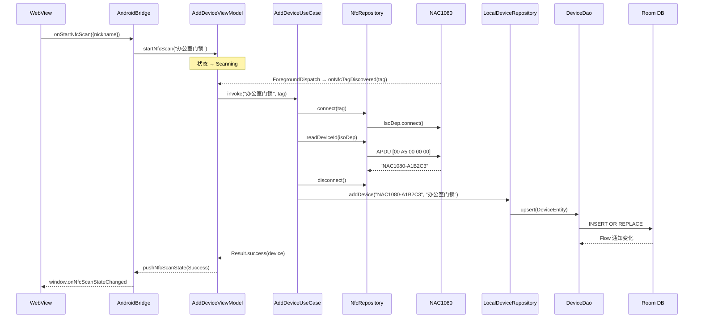

# 04 设备管理模块 Phase 1 实现总结

## 功能概述

- 设备列表：从 Room 读取，Flow 驱动实时刷新
- 搜索过滤：纯本地按昵称关键词过滤
- 添加设备：NFC 读取 deviceId → 写入 Room
- 解绑设备：从 Room 删除记录

## 调用流程

```mermaid
flowchart TD
    subgraph list ["设备列表"]
        A1["进入设备页"] --> A2["DeviceListViewModel.init"]
        A2 --> A3["getDeviceListUseCase()\n订阅 Room Flow"]
        A3 --> A4["Room 数据变化\n自动推送新列表"]
        A4 --> A5["Bridge.pushDeviceList\n→ window.onDevicesLoaded"]
    end

    subgraph add ["添加设备"]
        B1["用户输入昵称"] --> B2["onStartNfcScan(nickname)"]
        B2 --> B3["进入 Scanning 状态"]
        B3 --> B4["NFC Tag 到达"]
        B4 --> B5["AddDeviceUseCase"]
        B5 --> B6["NFC connect → readDeviceId → disconnect"]
        B6 --> B7["deviceRepository.addDevice\n写入 Room"]
        B7 --> B8["Room Flow 自动触发列表刷新"]
    end

    subgraph search ["搜索"]
        C1["输入关键词"] --> C2["SearchDevicesUseCase\n纯内存过滤"]
        C2 --> C3["更新 filteredDevices"]
    end
```

## 数据流

## 涉及文件

| 文件 | 职责 |
|:-----|:-----|
| `presentation/devices/DeviceListViewModel.kt` | 列表状态管理 + 搜索 |
| `presentation/adddevice/AddDeviceViewModel.kt` | NFC 扫描流程管理 |
| `domain/usecase/device/*.kt` | 4 个 UseCase |
| `data/local/LocalDeviceRepository.kt` | Room 读写 |
| `data/local/DeviceDao.kt` | SQL 操作 |

## 设计理由

1. **Room Flow 驱动**：使用 `observeAll()` 返回 Flow，任何写操作（添加/删除）自动触发 UI 刷新，无需手动调用 refresh。
2. **搜索在 UseCase 层**：纯内存过滤，不走数据库 LIKE 查询——数据量小（家用锁场景，设备通常 < 50）时更高效。
3. **NFC 连接即用即放**：readDeviceId 后立即 disconnect，减少 NFC 占用时间。

## Phase 2 演进

- `loadDevices()` 增加 `fetchAndCacheDevices()`（GET /devices → Room）
- `addDevice()` 增加 POST /devices/bind（云端注册）
- `removeDevice()` 增加 DELETE /devices/{id}
- 新增离线横幅（isOffline 状态）
- 新增设备详情 + 授权用户列表
