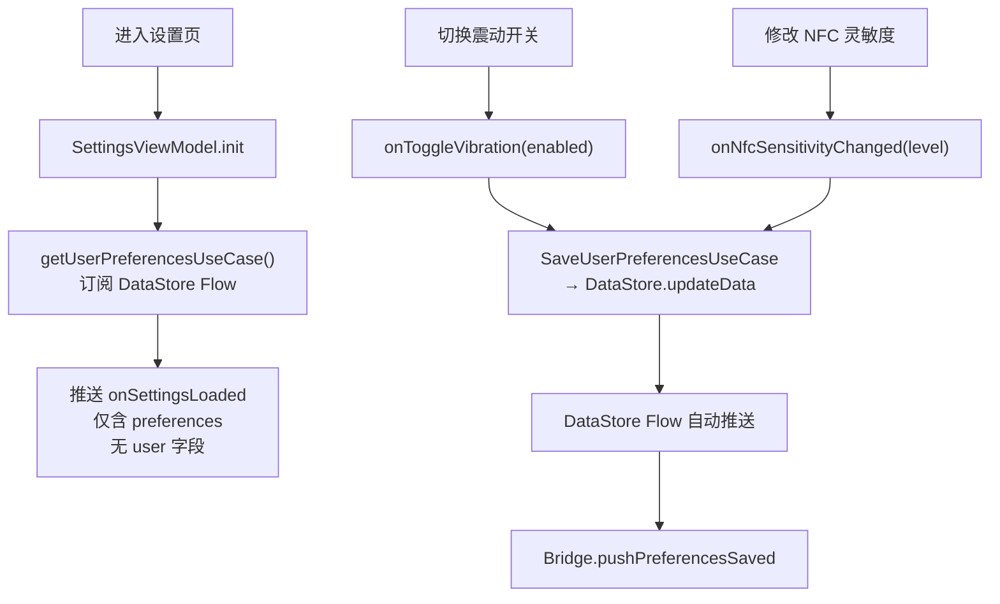
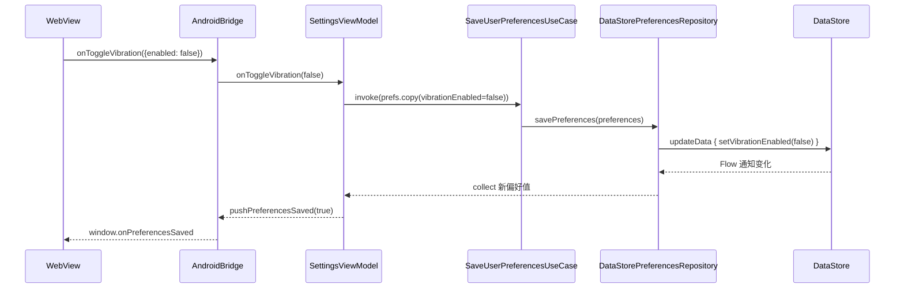

# 06 设置模块 Phase 1 实现总结

## 功能概述

- 震动反馈开关：读取/保存到 DataStore
- NFC 灵敏度设置：三级可选（High/Medium/Low），持久化到 DataStore
- 登出/注销/修改密码/在线模式：全部 stub

## 调用流程

## 数据流

## 涉及文件

| 文件 | 职责 |
|:-----|:-----|
| `presentation/settings/SettingsViewModel.kt` | 偏好状态管理 |
| `domain/usecase/settings/*.kt` | 2 个 UseCase |
| `data/local/DataStorePreferencesRepository.kt` | DataStore 读写 |
| `proto/user_prefs.proto` | Proto 结构定义 |

## 设计理由

1. **DataStore 而非 SharedPreferences**：DataStore 在协程中异步读写，不会在主线程 ANR；支持 Flow 观察；Proto 序列化类型安全。
2. **Stub 方法保留**：登出/注销等 Phase 2 方法在 ViewModel 中保留空实现，WebView 端调用不会崩溃。
3. **NfcSensitivity 枚举**：使用 `fromString()` 安全解析，避免前端传入非法值导致异常。

## Phase 2 演进

- 新增用户信息展示（User 对象从 DataStore/内存读取）
- `onLogout()` → `LogoutUseCase` → 清 Token + Room → 跳登录页
- `onDeleteAccountClicked()` → 二次确认弹窗 → `DeleteAccountUseCase`
- 修改密码入口跳转 UpdatePassword 页
- 在线模式开关启用
