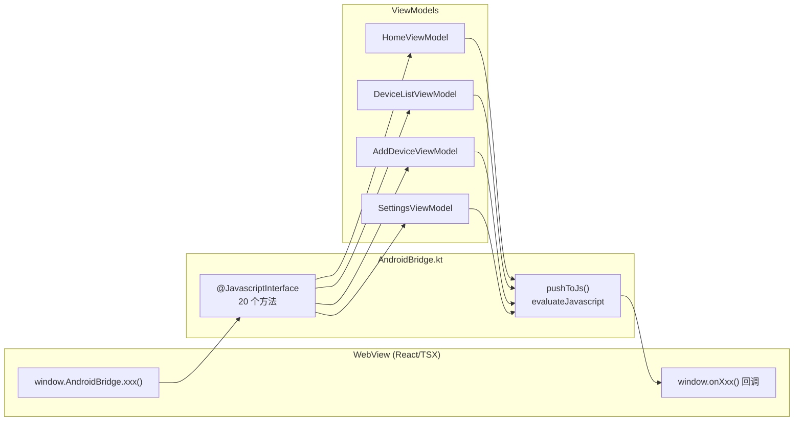
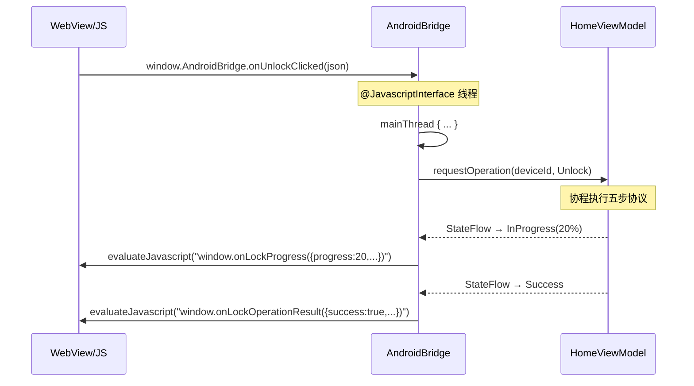

# 07 WebView 桥接模块 Phase 1 实现总结

## 功能概述

连接前端 React/TSX 页面与 Android 原生业务逻辑：
- JS → Native：10 个 Phase 1 接口 + 10 个 Phase 2 stub
- Native → JS：6 种回调推送

## 消息分发架构

## Phase 1 接口清单

### JS → Native（已实现）

| 方法 | 分发目标 | 参数 |
|:-----|:---------|:-----|
| `onUnlockClicked` | HomeViewModel | `{deviceId, deviceName}` |
| `onLockClicked` | HomeViewModel | `{deviceId, deviceName}` |
| `onOperationCancelled` | HomeViewModel | 无 |
| `onRefreshDeviceList` | DeviceListViewModel | 无 |
| `onSearchKeywordChanged` | DeviceListViewModel | `{keyword}` |
| `onUnlockFromList` | HomeViewModel | `{deviceId, deviceName}` |
| `onStartNfcScan` | AddDeviceViewModel | `{nickname}` |
| `onCancelNfcScan` | AddDeviceViewModel | 无 |
| `onToggleVibration` | SettingsViewModel | `{enabled}` |
| `onNfcSensitivityChanged` | SettingsViewModel | `{level}` |

### Native → JS（已实现）

| 回调 | 来源 | 数据 |
|:-----|:-----|:-----|
| `onLockProgress` | HomeViewModel | `{progress, stepText}` |
| `onLockOperationResult` | HomeViewModel | `{success, message, isRetryable}` |
| `onNfcStatusChanged` | NFC 广播 | `{enabled}` |
| `onDevicesLoaded` | DeviceListViewModel | `{devices[], isOffline}` |
| `onNfcScanStateChanged` | AddDeviceViewModel | `{state, deviceId?, message?}` |
| `onPreferencesSaved` | SettingsViewModel | `{success}` |

## 数据流（以开锁为例）

## 涉及文件

| 文件 | 职责 |
|:-----|:-----|
| `bridge/AndroidBridge.kt` | 桥接器（接收+推送） |
| `ui/MainActivity.kt` | 注册 Bridge + 收集状态推送 |

## 设计理由

1. **集中式桥接器**：所有 JS→Native 方法在 AndroidBridge 一个类中，避免 ViewModel 直接暴露给 WebView。
2. **mainThread 包装**：`@JavascriptInterface` 方法在 WebView 线程调用，ViewModel 操作需切主线程。
3. **JSON 字符串通信**：JS 和 Kotlin 之间只传 JSON 字符串，解耦两侧的数据结构。
4. **Phase 2 stub**：stub 方法只打日志不执行，前端意外调用不会崩溃。

## Phase 2 演进

- 新增 6 个 JS→Native 接口（登录/登出/权限/设备详情等）
- 新增 8 个 Native→JS 回调（登录结果/强退/设备详情/断网等）
- `AndroidBridge` 注入 `AuthViewModel` 和 `DeviceDetailViewModel`
- 新增 `window.onForceLogout` 强退机制
