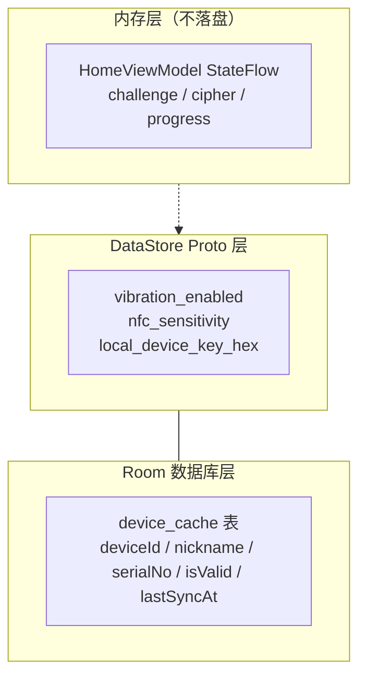
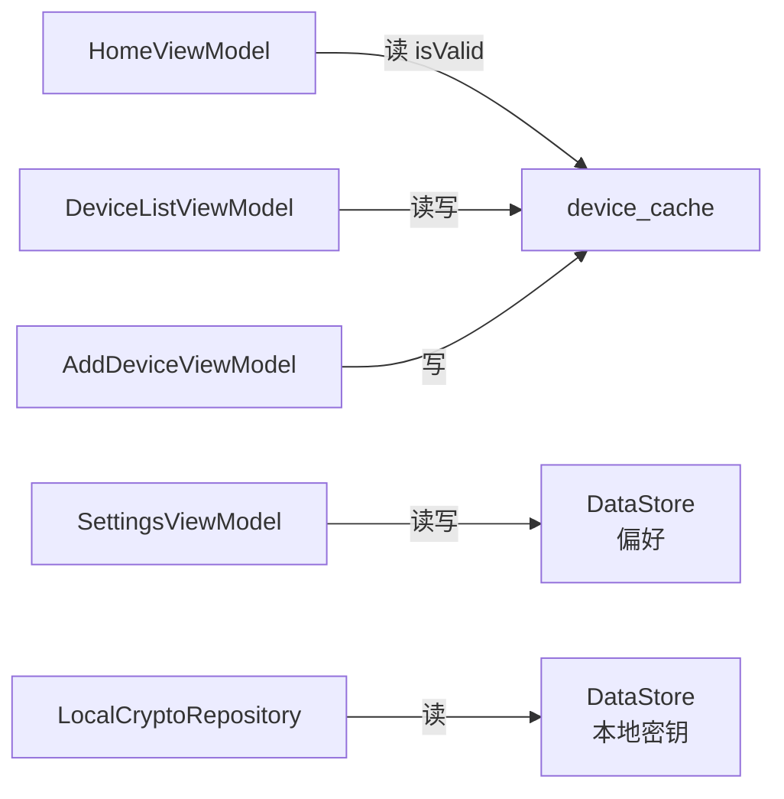

# 08 本地存储模块 Phase 1 实现总结

## 功能概述

- Room：`device_cache` 一张表，存储设备列表
- DataStore Proto：用户偏好（震动、灵敏度）+ 本地调试密钥
- 无 Token 存储

## 存储分层

## Room 表结构

**device_cache**

| 列名 | 类型 | 说明 |
|:-----|:-----|:-----|
| deviceId (PK) | TEXT | 硬件唯一标识 |
| nickname | TEXT | 用户昵称 |
| serialNo | TEXT | 硬件序列号 |
| isValid | INTEGER | 1=有效, 0=撤销 |
| lastSyncAt | INTEGER | 最后同步时间戳 |

## DataStore Proto 结构

| 字段 | 类型 | 默认值 | 用途 |
|:-----|:-----|:-------|:-----|
| vibration_enabled | bool | true | 震动开关 |
| nfc_sensitivity | string | "Medium" | NFC 灵敏度 |
| local_device_key_hex | string | "" | 调试密钥 |

## 各模块读写关系

## 涉及文件

| 文件 | 职责 |
|:-----|:-----|
| `data/local/entity/DeviceEntity.kt` | Room 实体 |
| `data/local/DeviceDao.kt` | Room DAO |
| `data/local/AppDatabase.kt` | Room Database 定义 |
| `proto/user_prefs.proto` | DataStore Proto 定义 |
| `data/local/UserPrefsSerializer.kt` | Proto 序列化器 |
| `data/local/DataStorePreferencesRepository.kt` | DataStore 读写实现 |
| `di/DatabaseModule.kt` | Room 单例提供 |
| `di/PreferencesModule.kt` | DataStore 单例提供 |

## 设计理由

1. **Room + Flow**：设备列表使用 Room Flow，写入后自动通知观察者，无需手动刷新。
2. **Proto DataStore**：类型安全、支持增量字段、协程友好——优于 SharedPreferences。
3. **分表策略**：Phase 1 仅一张表，Phase 2/3 按需新增，通过 Migration 平滑升级。
4. **密钥在 DataStore**：调试密钥放 DataStore 而非硬编码，支持运行时更换（调试不同设备）。

## Phase 2 演进

- 新增 `authorized_user_cache` 表（设备授权用户）
- DataStore 新增 Token 加密字段（encrypted_access_token 等）
- 移除 `local_device_key_hex` 字段
- Token 使用 KeystoreManager AES-GCM 加密后存储
- Phase 3 新增 `pending_reports` 表
