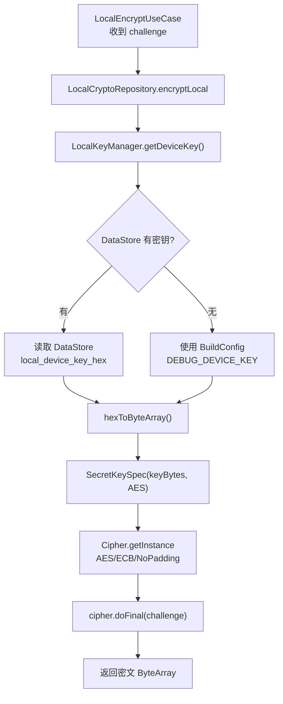

# 11 安全模块 Phase 1 实现总结

## 功能概述

Phase 1 安全范围有限，仅管理 NFC 调试密钥：
- 密钥来源：BuildConfig 默认值 或 DataStore 运行时配置
- 密钥用途：AES/ECB/NoPadding 加密 NFC challenge
- 明文存储（仅调试）

## 本地加密流程

## 安全措施清单

| 检查项 | Phase 1 状态 | 说明 |
|:-------|:-------------|:-----|
| NFC challenge 不落盘 | 已实现 | 协程局部变量，操作结束自动释放 |
| NFC 密文不落盘 | 已实现 | 同上 |
| allowBackup="false" | 已实现 | AndroidManifest 已配置 |
| 调试密钥可配置 | 已实现 | DataStore + BuildConfig 双源 |
| HTTPS 全站 | N/A | Phase 1 无网络 |
| Token 加密存储 | N/A | Phase 1 无 Token |
| 证书固定 | N/A | Phase 3 |

## 涉及文件

| 文件 | 职责 |
|:-----|:-----|
| `data/local/security/LocalKeyManager.kt` | 密钥获取 + 更新 |
| `data/local/LocalCryptoRepository.kt` | AES 加密执行 |
| `app/build.gradle.kts` | BuildConfig.DEBUG_DEVICE_KEY 配置 |

## 设计理由

1. **双源密钥**：BuildConfig 提供默认值（零配置即可调试），DataStore 支持运行时更换（调试不同设备）。
2. **AES/ECB/NoPadding**：根据 NAC1080 硬件协议要求选择（需联调确认，可能需调整为 CBC 等模式）。
3. **明文存储是有意为之**：Phase 1 为调试阶段，密钥安全性让步于调试便利性。

## Phase 2 演进

- 移除 `LocalKeyManager`（设备密钥改由云端管理）
- 新增 `KeystoreManager`（Android Keystore AES-256-GCM）
- Token 写入前用 Keystore 加密，读取时解密
- Phase 3：新增 CertificatePinner（OkHttp 证书固定）
