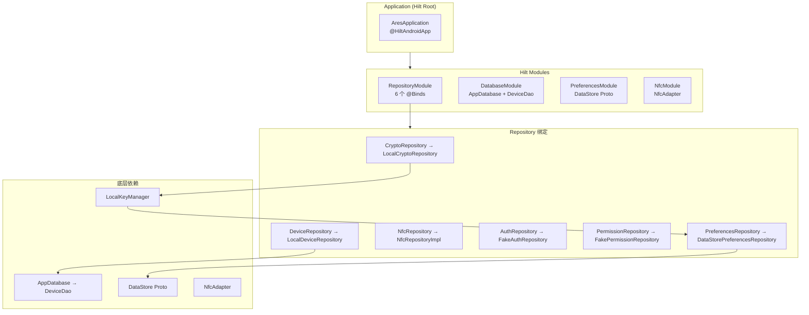

# 12 依赖注入模块 Phase 1 实现总结

## 功能概述

使用 Hilt（Google 官方推荐的 DI 框架）管理全部依赖：
- 4 个 Hilt Module：Repository、Database、Preferences、Nfc
- 6 个 Repository 接口绑定到 Phase 1 实现
- 全局单例生命周期（SingletonComponent）

## Phase 1 依赖图



## Phase 1 vs Phase 2 绑定对比

| 接口 | Phase 1 实现 | Phase 2 实现 |
|:-----|:-------------|:-------------|
| CryptoRepository | LocalCryptoRepository | RemoteCryptoRepository |
| DeviceRepository | LocalDeviceRepository | RemoteDeviceRepository |
| AuthRepository | FakeAuthRepository | RemoteAuthRepository |
| PermissionRepository | FakePermissionRepository | RemotePermissionRepository |
| NfcRepository | NfcRepositoryImpl | NfcRepositoryImpl（不变） |
| PreferencesRepository | DataStorePreferencesRepository | DataStorePreferencesRepository（不变） |

## 切换策略

Phase 2 升级时只需修改 `RepositoryModule.kt` 中的 `@Binds` 绑定：

```
// Phase 1
abstract fun bindCryptoRepository(impl: LocalCryptoRepository): CryptoRepository

// Phase 2 改为
abstract fun bindCryptoRepository(impl: RemoteCryptoRepository): CryptoRepository
```

ViewModel 和 UseCase 层代码**零改动**——这是接口隔离 + DI 的核心价值。

## 涉及文件

| 文件 | 职责 |
|:-----|:-----|
| `AresApplication.kt` | Hilt 根容器 |
| `di/RepositoryModule.kt` | 6 个 Repository 绑定 |
| `di/DatabaseModule.kt` | Room 数据库 + DAO 提供 |
| `di/PreferencesModule.kt` | DataStore 提供 |
| `di/NfcModule.kt` | NfcAdapter 提供 |

## 设计理由

1. **接口 + DI = 可替换性**：UseCase 只依赖接口，不依赖具体实现。Phase 切换时只改 DI 绑定。
2. **SingletonComponent**：所有 Repository 为全局单例，避免重复创建（Room、DataStore 本身也应单例）。
3. **@Binds vs @Provides**：接口绑定用 `@Binds`（abstract，无实例化逻辑）；第三方库对象用 `@Provides`（需手动创建）。
4. **NfcAdapter 可空**：`NfcModule` 返回 `NfcAdapter?`，由 SplashViewModel 处理 null 场景。

## Phase 2 演进

- 新增 `NetworkModule`（OkHttpClient + Retrofit + ApiService）
- 新增 `SecurityModule`（KeystoreManager）
- `RepositoryModule` 切换 4 个绑定到 Remote 实现
- 其他所有层（UseCase、ViewModel、Bridge）零改动
