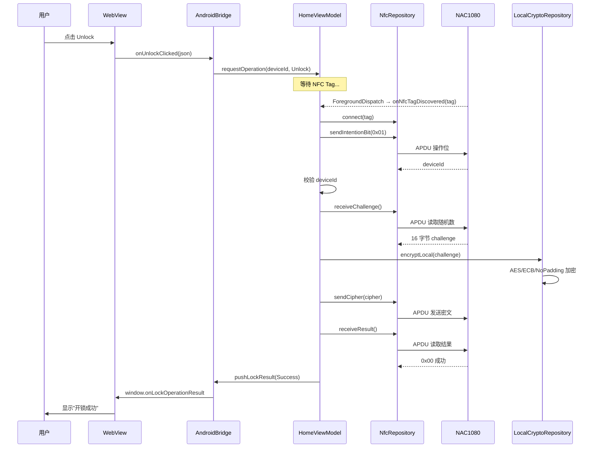

# Phase 1 实现总览

> **目标**：调通与 NAC1080 无源锁的 NFC 通信，实现本地密钥加密的开/关锁功能。  
> **不涉及**：账户登录/注销、云端 API、Token 管理、权限管理。

---

## 架构分层

```mermaid
flowchart TB
    subgraph UI ["UI 层"]
        SplashActivity["SplashActivity\nNFC 检测 → 路由"]
        MainActivity["MainActivity\nWebView 壳 + NFC Dispatch"]
        WebView["WebView (React/TSX)\n7 个页面"]
    end

    subgraph Bridge ["桥接层"]
        AB["AndroidBridge\n@JavascriptInterface\n10 个 Phase1 接口 + 10 个 stub"]
    end

    subgraph Presentation ["Presentation 层"]
        SVM["SplashViewModel"]
        HVM["HomeViewModel\n五步协程"]
        DVM["DeviceListViewModel"]
        ADVM["AddDeviceViewModel"]
        SetVM["SettingsViewModel"]
    end

    subgraph Domain ["Domain 层"]
        UC["UseCase × 12\nlock(5) + device(4) + settings(2) + auth stub"]
        Model["Model × 8\nDevice, User, LockOperation..."]
    end

    subgraph Data ["Data 层"]
        RepoIF["Repository 接口 × 6"]
        LocalCrypto["LocalCryptoRepository\n本地 AES 加密"]
        LocalDevice["LocalDeviceRepository\nRoom 读写"]
        NfcImpl["NfcRepositoryImpl\nIsoDep 通信"]
        FakeAuth["FakeAuthRepository"]
        FakePerm["FakePermissionRepository"]
        DSPrefs["DataStorePreferencesRepository"]
    end

    subgraph Infra ["基础设施"]
        Room["Room\ndevice_cache 表"]
        DS["DataStore Proto\n偏好 + 本地密钥"]
        Hilt["Hilt DI\n6 个 Repository 绑定"]
    end

    UI --> Bridge --> Presentation --> Domain --> Data --> Infra
```

---

## 参与模块一览

| 模块 | 参与程度 | 核心交付物 |
|:-----|:---------|:-----------|
| 01 启动与路由 | 简化 | SplashActivity + SplashViewModel（仅 NFC 检测） |
| 02 认证 | Stub | FakeAuthRepository + AuthViewModel 骨架 |
| 03 NFC 核心 | 核心 | 五步协程 + LocalEncryptUseCase + NfcRepositoryImpl |
| 04 设备管理 | 简化 | LocalDeviceRepository + Room device_cache |
| 05 权限管理 | Stub | FakePermissionRepository |
| 06 设置 | 简化 | 震动开关 + NFC 灵敏度（DataStore） |
| 07 WebView 桥接 | 简化 | AndroidBridge（10 接口 + 10 stub） |
| 08 本地存储 | 简化 | Room 1 表 + DataStore Proto（无 Token） |
| 09 网络层 | 不参与 | — |
| 10 异常处理 | 简化 | NFC IOException / 超时 / 设备不符 |
| 11 安全 | 简化 | LocalKeyManager（明文调试密钥） |
| 12 依赖注入 | 完整 | RepositoryModule + 4 个基础模块 |

---

## 开/关锁核心流程

---

## 文件清单

本文件夹包含各模块的实现总结：

| 文档 | 内容 |
|:-----|:-----|
| [01-startup-impl.md](01-startup-impl.md) | 启动模块 |
| [03-nfc-core-impl.md](03-nfc-core-impl.md) | NFC 核心 |
| [04-device-impl.md](04-device-impl.md) | 设备管理 |
| [06-settings-impl.md](06-settings-impl.md) | 设置 |
| [07-bridge-impl.md](07-bridge-impl.md) | WebView 桥接 |
| [08-storage-impl.md](08-storage-impl.md) | 本地存储 |
| [11-security-impl.md](11-security-impl.md) | 安全 |
| [12-di-impl.md](12-di-impl.md) | 依赖注入 |
