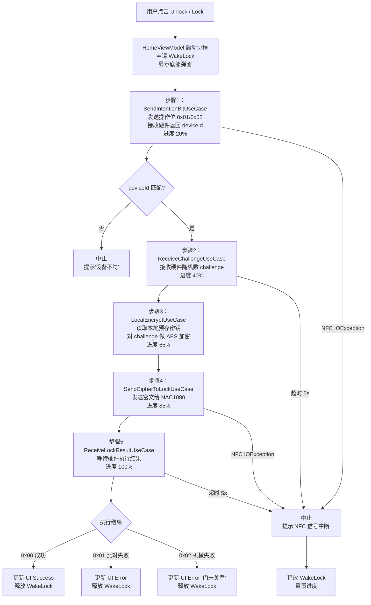
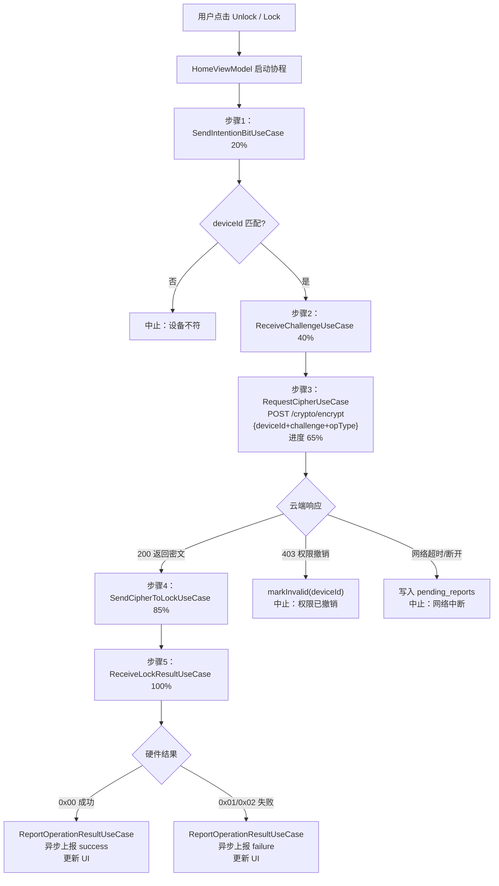
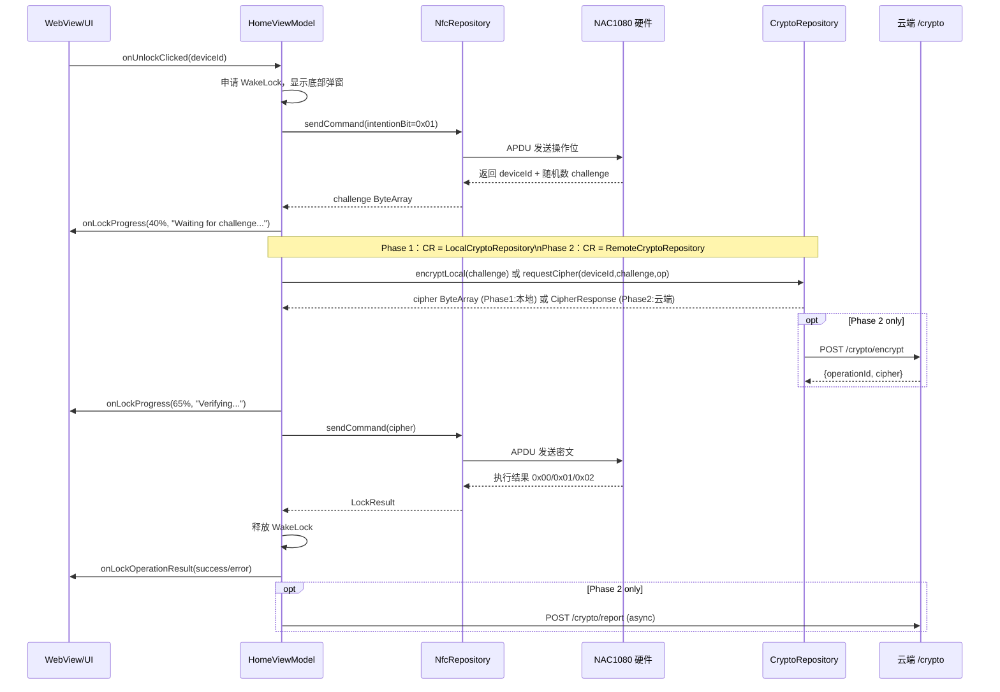
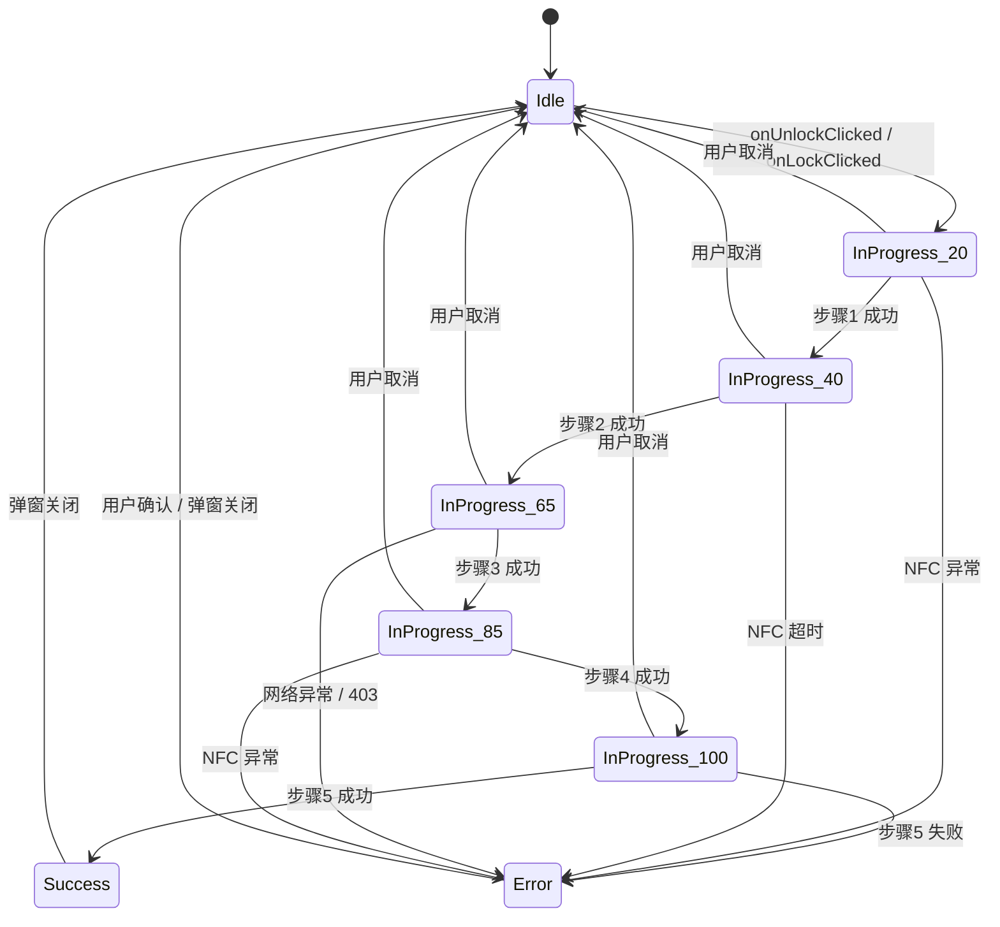

# 03 · NFC 核心模块：开/关锁五步协议 · 进度状态机 · 异常处理

> **模块边界**：从用户点击 Unlock/Lock 到操作最终完成（或取消/失败）的完整流程。  
> **依赖模块**：`07-webview-bridge`（进度回调）、`09-network`（云端加密请求，Phase 2+）、`08-storage`（pending_reports 写入，Phase 3）  
> **被依赖**：`07-webview-bridge`（桥接调用入口）

---

## Phase 1：硬件调试（本地加密）

### 职责范围

| 职责 | 说明 |
| :--- | :--- |
| 完整五步协议 | 步骤1-5 全部实现，步骤3 用本地密钥替代云端 |
| 本地密钥加密 | `LocalCryptoRepository` 读取预存密钥，对 challenge 做 AES 加密 |
| 进度状态机 | 每步更新进度百分比和 UI 文案，驱动底部弹窗 |
| NFC 连接管理 | IsoDep 建立、保持、关闭，ForegroundDispatch |
| WakeLock 管理 | 操作中申请屏幕常亮，操作结束释放 |
| 设备 ID 校验 | 防止 NFC 读到错误的锁 |
| **跳过** | `ReportOperationResultUseCase`（无云端上报）、`pending_reports` 写入 |

### 业务流程图



### 实现规格

#### LocalEncryptUseCase（新增，Phase 1 专用）

**文件**：`domain/usecase/lock/LocalEncryptUseCase.kt`

```kotlin
class LocalEncryptUseCase @Inject constructor(
    private val cryptoRepository: CryptoRepository
) {
    suspend fun execute(challenge: ByteArray): Result<ByteArray> {
        return cryptoRepository.encryptLocal(challenge)
    }
}
```

#### LocalCryptoRepository（新增，Phase 1 专用）

**文件**：`data/local/LocalCryptoRepository.kt`

```kotlin
class LocalCryptoRepository @Inject constructor(
    @ApplicationContext private val context: Context
) : CryptoRepository {

    // Phase 1：从 BuildConfig 或 DataStore 读取调试密钥
    // ⚠️ 仅用于调试！Phase 2 替换为 RemoteCryptoRepository
    private val localKeyHex: String = BuildConfig.DEBUG_DEVICE_KEY
    // 或从 DataStore 读取：val localKeyHex = prefsRepo.getLocalKey()

    override suspend fun encryptLocal(challenge: ByteArray): Result<ByteArray> {
        return try {
            val keyBytes = localKeyHex.hexToByteArray()
            val secretKey = SecretKeySpec(keyBytes, "AES")
            val cipher = Cipher.getInstance("AES/ECB/NoPadding") // 根据硬件协议调整
            cipher.init(Cipher.ENCRYPT_MODE, secretKey)
            Result.success(cipher.doFinal(challenge))
        } catch (e: Exception) {
            Result.failure(e)
        }
    }

    // Phase 2 方法：stub，不调用
    override suspend fun requestCipher(
        deviceId: String,
        challenge: ByteArray,
        operationType: OperationType
    ): Result<CipherResponse> {
        // TODO("Phase 2: 替换为 RemoteCryptoRepository")
        throw UnsupportedOperationException("Phase 2 not implemented")
    }

    override suspend fun reportResult(operationId: String, result: LockResult): Result<Unit> {
        // TODO("Phase 2: 替换为 RemoteCryptoRepository")
        return Result.success(Unit) // Phase 1 静默忽略
    }
}
```

#### CryptoRepository 接口（新增 encryptLocal 方法）

```kotlin
interface CryptoRepository {
    // Phase 1：本地加密
    suspend fun encryptLocal(challenge: ByteArray): Result<ByteArray>
    // Phase 2：云端加密
    suspend fun requestCipher(deviceId: String, challenge: ByteArray, operationType: OperationType): Result<CipherResponse>
    // Phase 2：结果上报
    suspend fun reportResult(operationId: String, result: LockResult): Result<Unit>
}
```

#### HomeViewModel（开锁协程 Phase 1 版）

```kotlin
private fun executeLockOperation(deviceId: String, operationType: OperationType) {
    lockJob = viewModelScope.launch {
        val wakeLock = acquireWakeLock()
        try {
            // 步骤1
            updateProgress(20, "Sending command to lock...")
            val hardwareDeviceId = sendIntentionBitUseCase(deviceId, operationType).getOrThrow()
            if (hardwareDeviceId != deviceId) throw DeviceMismatchException()

            // 步骤2
            updateProgress(40, "Waiting for hardware challenge...")
            val challenge = receiveChallengeUseCase().getOrThrow()

            // 步骤3 - Phase 1：本地加密；Phase 2：替换为 requestCipherUseCase
            updateProgress(65, "Encrypting locally...")
            val cipher = localEncryptUseCase(challenge).getOrThrow()

            // 步骤4
            updateProgress(85, "Sending cipher to lock...")
            sendCipherToLockUseCase(cipher).getOrThrow()

            // 步骤5
            updateProgress(100, "Executing...")
            val result = receiveLockResultUseCase(operationType).getOrThrow()

            // Phase 1：无 reportResult
            _uiState.update { it.copy(operationState = OperationState.Success("Operation successful")) }
        } catch (e: DeviceMismatchException) {
            _uiState.update { it.copy(operationState = OperationState.Error("设备不符", false)) }
        } catch (e: IOException) {
            _uiState.update { it.copy(operationState = OperationState.Error("NFC 信号中断，请重新靠近", true)) }
        } catch (e: Exception) {
            _uiState.update { it.copy(operationState = OperationState.Error(e.message ?: "操作失败", true)) }
        } finally {
            wakeLock.release()
        }
    }
}
```

### 验收要点

- [ ] NFC 能稳定连接 NAC1080，`IsoDep.connect()` 成功
- [ ] 发送操作位（0x01/0x02）后能收到硬件随机数
- [ ] 本地密钥加密后的密文能通过硬件验证（0x00 成功响应）
- [ ] 开锁/关锁机械动作正常执行
- [ ] 关锁场景：0x02 机械检测失败时提示「门未关严」
- [ ] 设备不符场景：正确中止并提示
- [ ] 进度条：0% → 20% → 40% → 65% → 85% → 100% 正常流转
- [ ] 底部弹窗「Cancel」按钮能取消协程并重置进度

---

## Phase 2：云端加密（完整五步协议）

### 新增 / 变更说明

| 变更项 | Phase 1 | Phase 2 |
| :--- | :--- | :--- |
| 步骤3 | `LocalEncryptUseCase`（本地密钥） | `RequestCipherUseCase`（POST /crypto/encrypt） |
| 步骤3 文案 | "Encrypting locally..." | "Verifying with cloud..." |
| 步骤3 异常 | 加密异常（极少） | 网络超时、网络断开、403 权限撤销 |
| 步骤结束后 | 无上报 | `ReportOperationResultUseCase`（异步上报） |

### 业务流程图



### 实现规格

#### RequestCipherUseCase（替换步骤3）

**文件**：`domain/usecase/lock/RequestCipherUseCase.kt`

```kotlin
class RequestCipherUseCase @Inject constructor(
    private val cryptoRepository: CryptoRepository
) {
    suspend fun execute(
        deviceId: String,
        challenge: ByteArray,
        operationType: OperationType
    ): Result<CipherResponse> = cryptoRepository.requestCipher(deviceId, challenge, operationType)
}
```

#### ReportOperationResultUseCase（新增）

**文件**：`domain/usecase/lock/ReportOperationResultUseCase.kt`

- 调用 `CryptoRepository.reportResult()` → POST `/crypto/report`
- 网络失败时写入 `pending_reports`（见 `10-exception.md`）
- 在 `viewModelScope.launch { }` 中**异步执行，不 await**

#### HomeViewModel 变更（步骤3 切换）

```kotlin
// Phase 2：替换步骤3
updateProgress(65, "Verifying with cloud...")
val cipherResp = requestCipherUseCase(deviceId, challenge, operationType).getOrThrow()
// 新增：步骤结束后异步上报
viewModelScope.launch { reportResultUseCase(cipherResp.operationId, result) }
```

### 验收要点

- [ ] 步骤3 向云端发起 POST /crypto/encrypt 请求
- [ ] 云端返回密文后能被硬件验证通过
- [ ] 403 场景：`device_cache.isValid` 更新为 false，设备列表灰化
- [ ] 网络中断（步骤3）：中止流程，显示错误提示
- [ ] `ReportOperationResultUseCase` 不阻塞主流程
- [ ] 云端日志：每次操作可在后台查到对应记录

---

## Phase 3：完整异常与上报

### 新增 / 变更说明

| 新增项 | 说明 |
| :--- | :--- |
| `pending_reports` 写入 | 步骤3+ 中断时写入 Room，等待后续上报 |
| App 切后台处理 | `onPause` → ForegroundDispatch 注销 → IsoDep IOException → 协程取消 |
| NFC 被关闭处理 | 广播 `STATE_OFF` → 中断协程 → 提示 |
| 协程取消 finally 块 | 确保 WakeLock 释放 + pending_reports 写入 |

### 完整异常处理表

| 异常类型 | 触发步骤 | 是否写 pending_reports | UI 表现 |
| :--- | :--- | :--- | :--- |
| `DeviceMismatchException` | 步骤1 | 否（未到云端） | "检测到的设备与所选设备不符" |
| NFC `IOException` | 任意步骤 | 步骤3+ 写入 | "NFC 信号中断，请重新靠近" |
| NFC 超时（5s） | 步骤2/4/5 | 步骤3+ 写入 | "NFC 响应超时，请重试" |
| 网络超时（10s） | 步骤3 | 是 | "网络超时，操作已取消" |
| 网络断开 | 步骤3 | 是 | "网络中断，操作已取消" |
| `403 Forbidden` | 步骤3 | 否 | "您已失去该设备操作权限" |
| 密文比对失败（0x01） | 步骤5 | 否（上报 failure） | "验证失败，请重试" |
| 机械检测失败（0x02） | 步骤5 | 否（上报 failure） | "关锁失败：门未完全关闭" |
| 用户取消 | 任意 | 步骤3+ 写入 | 弹窗关闭，进度重置 |

### 验收要点

- [ ] 步骤3+ 中断时 `pending_reports` 写入成功
- [ ] 网络恢复后 pending_reports 自动上报（WorkManager 触发）
- [ ] App 切后台 → NFC 断开 → 协程正确取消
- [ ] NFC 被关闭广播 → 操作取消提示
- [ ] 所有路径下 WakeLock 均能被释放（finally 块保证）

---

## 数据流时序图



---

## 进度状态机图


