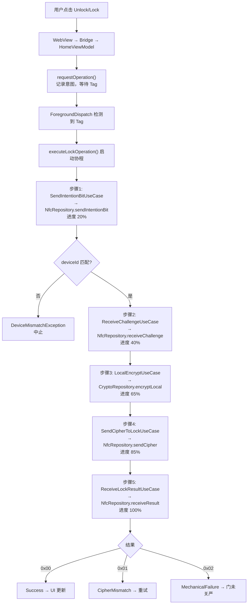
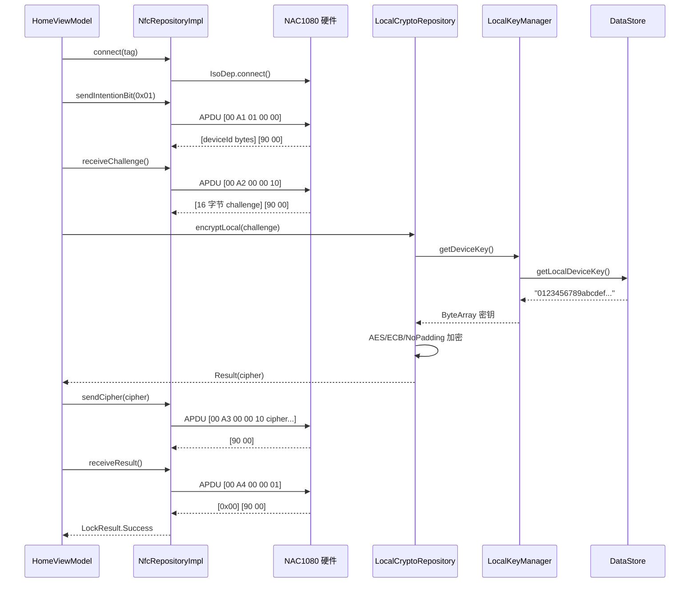
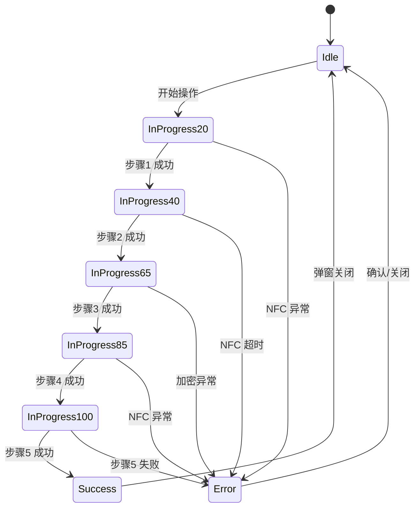

# 03 NFC 核心模块 Phase 1 实现总结

## 功能概述

完整实现五步开/关锁协议（步骤 3 使用本地密钥加密替代云端）：
1. 发送操作位 → 接收 deviceId
2. 接收硬件随机数 challenge
3. 本地 AES 加密 challenge → 生成密文
4. 发送密文给硬件
5. 接收执行结果（成功/密钥错误/机械失败）

## 调用流程

## 数据流

## 进度状态机

## 涉及文件

| 文件 | 职责 |
|:-----|:-----|
| `presentation/home/HomeViewModel.kt` | 五步协程编排、进度管理、异常处理 |
| `domain/usecase/lock/*.kt` | 5 个 UseCase（每步一个） |
| `data/nfc/NfcRepositoryImpl.kt` | IsoDep APDU 通信 |
| `data/local/LocalCryptoRepository.kt` | 本地 AES 加密 |
| `data/local/security/LocalKeyManager.kt` | 调试密钥管理 |

## 设计理由

1. **每步一个 UseCase**：单一职责，便于 Phase 2 单独替换步骤 3（LocalEncrypt → RequestCipher）。
2. **协程 + withTimeout**：NFC 操作天然串行，协程完美匹配；5 秒超时防止永久等待。
3. **进度状态机**：OperationState 密封类覆盖全部状态，when 表达式强制穷举。
4. **异常分层处理**：DeviceMismatch、IOException、Timeout、Cancellation 各有明确处理策略。

## Phase 2 演进

- 步骤 3 替换为 `RequestCipherUseCase`（POST /crypto/encrypt）
- 步骤 3 新增网络超时/403/断网异常分支
- 操作结束后新增 `ReportOperationResultUseCase`（异步上报）
- Phase 3：步骤 3+ 中断时写入 pending_reports
